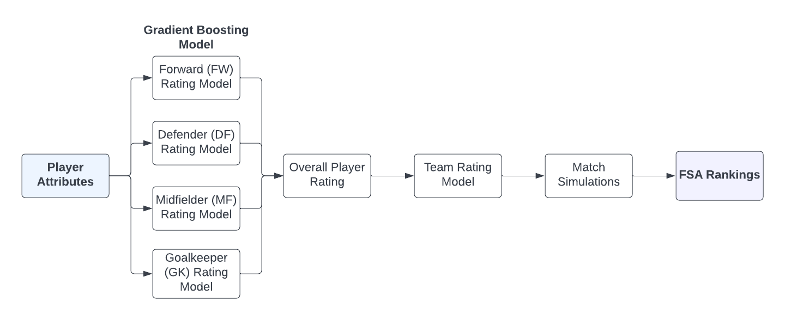
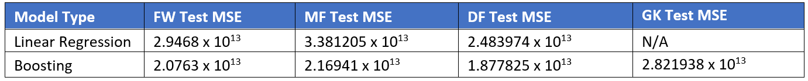

# Actuarial Theory and Practice A Assignment

By Aidan Yeoh, Alex Zhu, Annie Zhu, Matthew Winfred, Rosie Tao

1.  Background
2.  Data Cleaning Steps
3.  Modelling Steps
4.  Economic Impact Steps
5.  Conclusion

```{r library, include = FALSE}
library(dplyr)
library(ggplot2)
library(gbm)
library(pdp)
library(ggalt)
```

For Data Collection, we have conducted the following steps:
1. Excel files are converted to R via `convert_excel_to_r.R`. The file mainly uses `readxl` package to read excel tables of specified ranges.
2. Cleaning and preparation pipelines are built in `R_files/merge_data.R`. This file treats merges data sets from different excel sheets together, manages data inconsistencies, imputes missing or negative values, and remove unnecessary columns.
3. Exploratory Data Analysis are conducted in `R_files/exploratory.R` as well as a preliminary linear regression. Some plots from exploratory analysis are generated below.

```{r setup, include = FALSE}
source("R_files/Annie's preprocessing.R")
source("R_files/filter_pipeline_exploratory.R")
PLAYER_tourn_res_2020 <- readxl::read_excel("data/player-modified.xlsx",sheet = "Tournament Results",range= "B11:C27")
PLAYER_tourn_res_2021 <- readxl::read_excel("data/player-modified.xlsx",sheet = "Tournament Results",range= "E11:F35")
```

We can see that the Raritan Football League has a much lower Annualised Salary compared to the other leagues.
```{r Annualized_Salary_League}
ggplot(PLAYER_league_non_goal_salary, aes(x = League, 
                                          y = Annualized_Salary))+
    geom_boxplot()+
    labs(x = "League", y = expression(paste("Standardised Salary (",partialdiff,")")), title = "Box Plot of Annualized Salary per League")+
    theme(axis.text=element_text(size=9.5), axis.title=element_text(size=13, face = "bold"), plot.title = element_text(size=14, face = "bold"))+
    scale_y_continuous(labels = scales::unit_format(unit = "M", scale = 1e-6))
```
Forward positions are shown to have higher `shots on target per 90 minutes`, as well as various other shooting metrics, including `expected goals`, `shots total per 90 minutes`. This position are shown to have higher value.
```{r Box Plots on Standard_Sh/90}
require(gridExtra)
p1<- ggplot(data = PLAYER_league_non_goal_salary %>% filter(Pos_new != "GK"), aes(x = Pos_new, y = `Standard_SoT/90`)) + 
    geom_boxplot(outlier.shape = NA) + 
    coord_cartesian(ylim =  c(0, 3)) +
    labs(x = "Position")

p2<-ggplot(data = PLAYER_league_non_goal_salary %>% filter(Pos_new != "GK"), aes(x = Pos_new, y = `Expected_xG`)) + 
    geom_boxplot(outlier.shape = NA) + 
    coord_cartesian(ylim =  c(0, 1))+
    labs(x = "Position")

p3<-ggplot(data = PLAYER_league_non_goal_salary %>% filter(Pos_new != "GK"), aes(x = Pos_new, y = `Standard_Sh/90`)) + 
    geom_boxplot(outlier.shape = NA) + 
    coord_cartesian(ylim =  c(0, 5)) +
    labs(x = "Position")
grid.arrange(p1,p2,p3,ncol = 1)
```

Based on the results from Linear Regression, players with low Annualized Salary and high Predicted Salary would be the players desirable for the Raritan Football Team.
```{r linear_regression_models}
# LINEAR REGRESSION

cols_to_remove <- c("Pos_new","Player","Nation","League","Squad")
pos_levels <- c("MF","DF","FW")

for (level in pos_levels) {
    eval(call("<-",paste0(level,"_nonRFL"),
              nonRFL %>% filter(Pos_new == level) %>% select(-all_of(cols_to_remove))))
    eval(call("<-",paste0(level,"_RFL"),
              RFL %>% filter(Pos_new == level) %>% select(-all_of(cols_to_remove))))
    eval(call("<-",paste0(level,"_nonRFL_mod"),
              glm(Annualized_Salary ~ ., data = eval(str2lang(paste0(level,"_nonRFL"))))))
    
    Predicted_Sal<- predict(eval(str2lang(paste0(level,"_nonRFL_mod"))),newdata = eval(str2lang(paste0(level,"_RFL"))))
    eval(call("<-",paste0(level,"_RFL"),
              cbind(get(paste0(level,"_RFL")),Predicted_Sal)))
    
    Diff <- eval(str2lang(paste0(level,"_RFL")))["Predicted_Sal"] - eval(str2lang(paste0(level,"_RFL")))["Annualized_Salary"]
    names(Diff) <- "Diff"
    eval(call("<-",paste0(level,"_RFL"),
              cbind(get(paste0(level,"_RFL")),Diff)))
    
    
}

par(mfrow= c(1,3))
plot(MF_RFL$Annualized_Salary,MF_RFL$Predicted_Sal, main= "MF RFL")
plot(DF_RFL$Annualized_Salary,DF_RFL$Predicted_Sal, main= "DF RFL")
plot(FW_RFL$Annualized_Salary,FW_RFL$Predicted_Sal, main= "FW RFL")
```


# Modelling Steps



## Player Rating Model

Our team is chosen from a pool of RFL players exclusively to prevent language, cultural and political barriers from impeding overall team cohesion (Malesky, Saiegh 2014). This selection consists of 5 forwards, 7 midfielders, 7 defenders, and 3 goalkeepers. The modelling of individual player ratings assumes the following:

* Salaries of league players are reflective of their skill level.
* The attributes relevant in determining skill level are position-specific. Thus, player ratings for each position should be modelled individually. 
* Player performance in leagues translates to tournaments.
* The level of play is consistent across leagues.

Although player salary is the assumed player rating metric, exploratory analysis shows that salaries in RFL deviate noticeably compared to other leagues despite RFL players delivering similar performances. Thus, the use of a model linking player attributes to a standardised salary figure is necessary. 


To develop a predictive model linking player attributes to salaries, the evaluation criteria of validation-set error is used. The non-RFL league player data is split into a 90% training set and 10% test set. Several candidate models are then fitted, and their corresponding validation-set error computed. Note that:

* Model fitting occurred independently for each position (FW, DF, MF, GK).
* Goalkeepers are modelled only using goalkeeping data. Here, it is assumed that goalkeepers do not require the same level of attacking, passing etc. as other positions, and that goalkeeping specific skills are their most important attributes.



The selected player-rating model is a gradient boosting model (GBM) trained on the non-RFL player league due to its higher predictive performance (at the cost of less interpretability). The four boosting models utilise the following parameters:

* An interaction depth of 1 resulting in each tree becoming a stump. This leads to a more interpretable additive model.
* A shrinkage parameter of 0.01 which is sufficiently low for predictive needs.
* The number of trees is calculated using 10-fold cross-validation error. As a large number of trees will lead to overfitting and a small number of trees will be inflexible, the number of trees that corresponds to the lowest cross-validation error is selected.

```{r gbm_main, include = FALSE, eval = FALSE}

MF_RFL %>% arrange(Diff,descending = T)
DF_RFL %>% arrange(Diff,descending = T)
FW_RFL %>% arrange(Diff,descending = T)


## DO NOT CHANGE COLUMN ORDER -> CHANGING COLUMN ORDER WILL REQUIRE THE FOLLOWING CODE TO BE MODIFIED ##

#Fit boosting model on annualised salary dataset with non RFL football leagues and ALL predictors
set.seed(1)
colnames(df)[c(1,2,3,4,5,71)]

gbmFit.param <- gbm(Annualized_Salary ~., data = df[df['League'] != "RFL",-c(1,2,3,4,5,71)], distribution = "gaussian", cv.fold = 10, n.trees = 3000, interaction.depth = 1, shrinkage = 0.01)
gbmFit.param

min <- which.min(gbmFit.param$cv.error)
min
gbm.perf(gbmFit.param, method = "cv")

gbmFit <- gbm(Annualized_Salary ~., df[df['League'] != "RFL",-c(1,2,3,4,5,71)], distribution = "gaussian", n.trees = min, interaction.depth = 1, shrinkage = 0.01)

summary(gbmFit)

gbm.predict = predict(gbmFit, newdata = df[,-c(1,2,3,4,5,70,71)], n.trees = min, type = "response")


plot(gbm.predict[(df['League'] != "RFL")], df$Annualized_Salary[(df['League'] != "RFL")])
plot(gbm.predict[(df['League'] == "RFL")], df$Annualized_Salary[(df['League'] == "RFL")])

plot(gbm.predict[(df['Nation'] != "Rarita")], df$Annualized_Salary[(df['Nation'] != "Rarita")])
plot(gbm.predict[(df['Nation'] == "Rarita")], df$Annualized_Salary[(df['Nation'] == "Rarita")])

```

```{r cor_df, include = FALSE}

#New dataframe with correlated vairables removed + identifiable attributes
cor_df_merge <- cbind(cor_df,df[,c("Player","Nation","Pos_new","League","Squad")])
stopifnot((nrow(cor_df_merge) == 5500) && (length(colnames(cor_df_merge))== 23)) # Added check 
set.seed(1)

```

```{r player_rating_fitting, eval = FALSE}
#FW Player Rating Model
gbmFit.param_FW <- gbm(Annualized_Salary ~., data = cor_df_merge[(cor_df_merge['League'] != "RFL") & (cor_df_merge['Pos_new'] == "FW"),-c(19,20,21,22,23)], distribution = "gaussian", cv.fold = 10, n.trees = 3000, interaction.depth = 1, shrinkage = 0.01)
#MF Player Rating Model
gbmFit.param_MF <- gbm(Annualized_Salary ~., data = cor_df_merge[(cor_df_merge['League'] != "RFL") & (cor_df_merge['Pos_new'] == "MF"),-c(19,20,21,22,23)], distribution = "gaussian", cv.fold = 10, n.trees = 3000, interaction.depth = 1, shrinkage = 0.01)
#DF Player Rating Model
gbmFit.param_DF <- gbm(Annualized_Salary ~., data = cor_df_merge[(cor_df_merge['League'] != "RFL") & (cor_df_merge['Pos_new'] == "DF"),-c(19,20,21,22,23)], distribution = "gaussian", cv.fold = 10, n.trees = 3000, interaction.depth = 1, shrinkage = 0.01)
#GK Player Rating Model
gbmFit.param_GK <- gbm(Annualized_Salary ~., data = gk_df[(gk_df['League'] != "RFL"),-c(16,17,18,19,20)], distribution = "gaussian", cv.fold = 10, n.trees = 3000, interaction.depth = 1, shrinkage = 0.01)
```

```{r FW_Player_Rating, include = FALSE}
#FW Player Rating Model - Fitting using 10-fold CV error
gbmFit.param_FW <- gbm(Annualized_Salary ~., data = cor_df_merge[(cor_df_merge['League'] != "RFL") & (cor_df_merge['Pos_new'] == "FW"),-c(19,20,21,22,23)], distribution = "gaussian", cv.fold = 10, n.trees = 3000, interaction.depth = 1, shrinkage = 0.01)
gbmFit.param_FW
FW_cv <- gbm.perf(gbmFit.param_FW, method = "cv")
```

```{r FW_Player_Rating_Min, include = FALSE}
min_FW <- which.min(gbmFit.param_FW$cv.error)
min_FW

gbmFit_FW <- gbm(Annualized_Salary ~., cor_df_merge[(cor_df_merge['League'] != "RFL") & (cor_df_merge['Pos_new'] == "FW"),-c(19,20,21,22,23)], distribution = "gaussian", n.trees = min_FW, interaction.depth = 1, shrinkage = 0.01)

summary(gbmFit_FW)

gbm.predict_FW = predict(gbmFit_FW, newdata = cor_df_merge[,-c(17,19,20,21,22,23)], n.trees = min_FW, type = "response")

#Comparing actual vs expected in FW model
hist(gbm.predict_FW[(cor_df_merge['Pos_new'] == "FW") & (df['League'] != "RFL")])
hist(df$Annualized_Salary[(df['League'] != "RFL") & (df['Pos_new'] == "FW")], breaks = 20)

plot(gbm.predict_FW[(df['League'] == "RFL") & (cor_df_merge['Pos_new'] == "FW")], df$Annualized_Salary[(df['League'] == "RFL") & (cor_df_merge['Pos_new'] == "FW")])
plot(gbm.predict_FW[(df['League'] != "RFL") & (cor_df_merge['Pos_new'] == "FW")], df$Annualized_Salary[(df['League'] != "RFL") & (cor_df_merge['Pos_new'] == "FW")])

mean((gbm.predict_FW[(df['League'] != "RFL") & (cor_df_merge['Pos_new'] == "FW")]-df$Annualized_Salary[(df['League'] != "RFL") & (cor_df_merge['Pos_new'] == "FW")])^2)
```

```{r MF_Player_Rating, include = FALSE}
#MF Player Rating Model - Fitting using 10-fold CV error
gbmFit.param_MF <- gbm(Annualized_Salary ~., data = cor_df_merge[(cor_df_merge['League'] != "RFL") & (cor_df_merge['Pos_new'] == "MF"),-c(19,20,21,22,23)], distribution = "gaussian", cv.fold = 10, n.trees = 3000, interaction.depth = 1, shrinkage = 0.01)
gbmFit.param_MF
MF_cv <- gbm.perf(gbmFit.param_MF, method = "cv")
```

```{r MF_Player_Rating_Min, include = FALSE}
min_MF <- which.min(gbmFit.param_MF$cv.error)
min_MF
gbm.perf(gbmFit.param_MF, method = "cv")

gbmFit_MF <- gbm(Annualized_Salary ~., cor_df_merge[(cor_df_merge['League'] != "RFL") & (cor_df_merge['Pos_new'] == "MF"),-c(19,20,21,22,23)], distribution = "gaussian", n.trees = min_MF, interaction.depth = 1, shrinkage = 0.01)

summary(gbmFit_MF)
gbm.predict_MF = predict(gbmFit_MF, newdata = cor_df_merge[,-c(17, 19,20,21,22,23)], n.trees = min_MF, type = "response")

#Comparing actual vs expected in MF model
hist(gbm.predict_MF[(cor_df_merge['Pos_new'] == "MF") & (df['League'] != "RFL")])
hist(df$Annualized_Salary[(df['League'] != "RFL") & (df['Pos_new'] == "MF")], breaks = 20)

plot(gbm.predict_MF[(df['League'] == "RFL") & (cor_df_merge['Pos_new'] == "MF")], df$Annualized_Salary[(df['League'] == "RFL") & (cor_df_merge['Pos_new'] == "MF")])
plot(gbm.predict_MF[(df['League'] != "RFL") & (cor_df_merge['Pos_new'] == "MF")], df$Annualized_Salary[(df['League'] != "RFL") & (cor_df_merge['Pos_new'] == "MF")])

colnames(cor_df_merge)[c(17,19,20,21,22,23)]

mean((gbm.predict_MF[(df['League'] != "RFL") & (cor_df_merge['Pos_new'] == "MF")]-df$Annualized_Salary[(df['League'] != "RFL") & (cor_df_merge['Pos_new'] == "MF")])^2)
```

```{r DF_Player_Rating, include = FALSE}
#DF Player Rating Model - Fitting using 10-fold CV error
gbmFit.param_DF <- gbm(Annualized_Salary ~., data = cor_df_merge[(cor_df_merge['League'] != "RFL") & (cor_df_merge['Pos_new'] == "DF"),-c(19,20,21,22,23)], distribution = "gaussian", cv.fold = 10, n.trees = 3000, interaction.depth = 1, shrinkage = 0.01)
gbmFit.param_DF
DF_cv <- gbm.perf(gbmFit.param_DF, method = "cv")
```

```{r DF_Player_Rating_Min, include = FALSE}
min_DF <- which.min(gbmFit.param_DF$cv.error)
min_DF
gbm.perf(gbmFit.param_DF, method = "cv")

gbmFit_DF <- gbm(Annualized_Salary ~., cor_df_merge[(cor_df_merge['League'] != "RFL") & (cor_df_merge['Pos_new'] == "DF"),-c(19,20,21,22,23)], distribution = "gaussian", n.trees = min_DF, interaction.depth = 1, shrinkage = 0.01)

summary(gbmFit_DF)

gbm.predict_DF = predict(gbmFit_DF, newdata = cor_df_merge[,-c(17, 19,20,21,22,23)], n.trees = min_DF, type = "response")

#Comparing actual vs expected in DF model
hist(gbm.predict_DF[(cor_df_merge['Pos_new'] == "DF") & (df['League'] != "RFL")])
hist(df$Annualized_Salary[(df['League'] != "RFL") & (df['Pos_new'] == "DF")], breaks = 20)

plot(gbm.predict_DF[(df['League'] == "RFL") & (cor_df_merge['Pos_new'] == "DF")], df$Annualized_Salary[(df['League'] == "RFL") & (cor_df_merge['Pos_new'] == "DF")])
plot(gbm.predict_DF[(df['League'] != "RFL") & (cor_df_merge['Pos_new'] == "DF")], df$Annualized_Salary[(df['League'] != "RFL") & (cor_df_merge['Pos_new'] == "DF")])

mean((gbm.predict_DF[(df['League'] != "RFL") & (cor_df_merge['Pos_new'] == "DF")]-df$Annualized_Salary[(df['League'] != "RFL") & (cor_df_merge['Pos_new'] == "DF")])^2)
```

```{r GK_Player_Rating, include = FALSE}
#GK model
gbmFit.param_GK <- gbm(Annualized_Salary ~., data = gk_df[(gk_df['League'] != "RFL"),-c(16,17,18,19,20)], distribution = "gaussian", cv.fold = 10, n.trees = 3000, interaction.depth = 1, shrinkage = 0.01)
gbmFit.param_GK
GK_cv <- gbm.perf(gbmFit.param_GK, method = "cv")
```

```{r GK_Player_Rating_Min, include = FALSE}
min_GK <- which.min(gbmFit.param_GK$cv.error)
min_GK

gbmFit_GK <- gbm(Annualized_Salary ~., data = gk_df[(gk_df['League'] != "RFL"),-c(16,17,18,19,20)], distribution = "gaussian", cv.fold = 10, n.trees = min_GK, interaction.depth = 1, shrinkage = 0.01)
summary(gbmFit_GK)

gbm.predict_GK = predict(gbmFit_GK, newdata = gk_df[,-c(15,16,17,18,19,20)], n.trees = min_GK, type = "response")

#Comparing actual vs expected in GK model
plot(gbm.predict_GK[(gk_df['League'] == "RFL")], gk_df$Annualized_Salary[(gk_df['League'] == "RFL")])
plot(gbm.predict_GK[(gk_df['League'] != "RFL")], gk_df$Annualized_Salary[(gk_df['League'] != "RFL")])

mean((gbm.predict_GK[(gk_df['League'] != "RFL")]-gk_df$Annualized_Salary[(gk_df['League'] != "RFL")])^2)

```
To optimise the number of trees in the GBMs, CV error as a function of number of trees is plotted below. Note that the green and black lines represent test error and training error respectively.


```{r CV_plots, include = TRUE}
par(mfrow = c(2,2))
FW_cv <- gbm.perf(gbmFit.param_FW, method = "cv")
title(main = "FW")
MF_cv <- gbm.perf(gbmFit.param_MF, method = "cv")
title(main = "MF")
DF_cv <- gbm.perf(gbmFit.param_DF, method = "cv")
title(main = "DF")
GK_cv <- gbm.perf(gbmFit.param_GK, method = "cv")
title(main = "GK")
```

## Player Selection
Our goal is to enlist the most cost-efficient RFL players for player selection that maximise economic impact. These players exhibit the highest standardised-to-annualised salary ratios, delivering high performance at low cost. However, player selection is restricted to the top 25% highest-paid players to meet our FSA performance objectives. Without this additional restriction, sufficient competitiveness is not achieved.

``` {r Standardised_Graphs, include = TRUE, warning = FALSE}
#FW
FW_plot_data <- data.frame(cbind(Standardised_Salary = gbm.predict_FW[(df['League'] == "RFL") & (cor_df_merge['Pos_new'] == "FW")], Annualised_Salary = df$Annualized_Salary[(df['League'] == "RFL") & (cor_df_merge['Pos_new'] == "FW")]))
FW_select <- FW_plot_data[(gbm.predict_FW[(df['League'] == "RFL") & (cor_df_merge['Pos_new'] == "FW")]/df$Annualized_Salary[(df['League'] == "RFL") & (cor_df_merge['Pos_new'] == "FW")] > 4.41),]

ggplot(FW_plot_data, aes(x = Annualised_Salary, y = Standardised_Salary)) +
    geom_point()+
    theme_bw()+
    geom_smooth(method=lm, se = FALSE, formula=y~x-1)+
    geom_encircle(data = FW_select, color = "red", size = 2, expand = 0.03)+
    labs(x = expression(paste("Annualised Salary (",partialdiff,")")), y = expression(paste("Standardised Salary (",partialdiff,")")), title = "Relationship between Standardised and Annualised Salary", subtitle = "RFL FW Players")+
    theme(axis.text=element_text(size=9.5), axis.title=element_text(size=13, face = "bold"), plot.title = element_text(size=14, face = "bold"))+
    scale_y_continuous(labels = scales::unit_format(unit = "M", scale = 1e-6))+
    scale_x_continuous(labels = scales::unit_format(unit = "M", scale = 1e-6))

#MF
MF_plot_data <- data.frame(cbind(Standardised_Salary = gbm.predict_MF[(df['League'] == "RFL") & (cor_df_merge['Pos_new'] == "MF")], Annualised_Salary = df$Annualized_Salary[(df['League'] == "RFL") & (cor_df_merge['Pos_new'] == "MF")]))
MF_select <- MF_plot_data[
    (gbm.predict_MF[(df['League'] == "RFL") & (cor_df_merge['Pos_new'] == "MF")]/df$Annualized_Salary[(df['League'] == "RFL") & (cor_df_merge['Pos_new'] == "MF")]>4.4),]

ggplot(MF_plot_data, aes(x = Annualised_Salary, y = Standardised_Salary)) +
    geom_point()+
    theme_bw()+
    geom_smooth(method=lm, se = FALSE, formula=y~x-1)+
    geom_encircle(data = MF_select, color = "red", size = 2, expand = 0.03)+
    labs(x = expression(paste("Annualised Salary (",partialdiff,")")), y = expression(paste("Standardised Salary (",partialdiff,")")), title = "Relationship between Standardised and Annualised Salary", subtitle = "RFL MF Players")+
    theme(axis.text=element_text(size=9.5), axis.title=element_text(size=13, face = "bold"), plot.title = element_text(size=14, face = "bold"))+
    scale_y_continuous(labels = scales::unit_format(unit = "M", scale = 1e-6))+
    scale_x_continuous(labels = scales::unit_format(unit = "M", scale = 1e-6))

#DF
DF_plot_data <- data.frame(cbind(Standardised_Salary = gbm.predict_DF[(df['League'] == "RFL") & (cor_df_merge['Pos_new'] == "DF")], Annualised_Salary = df$Annualized_Salary[(df['League'] == "RFL") & (cor_df_merge['Pos_new'] == "DF")]))
DF_select <- DF_plot_data[(gbm.predict_DF[(df['League'] == "RFL") & (cor_df_merge['Pos_new'] == "DF")]/df$Annualized_Salary[(df['League'] == "RFL") & (cor_df_merge['Pos_new'] == "DF")] > 4.35),]

ggplot(DF_plot_data, aes(x = Annualised_Salary, y = Standardised_Salary)) +
    geom_point()+
    theme_bw()+
    geom_smooth(method=lm, se = FALSE, formula=y~x-1)+
    geom_encircle(data = DF_select, color = "red", size = 2, expand = 0.03)+
    labs(x = expression(paste("Annualised Salary (",partialdiff,")")), y = expression(paste("Standardised Salary (",partialdiff,")")), title = "Relationship between Standardised and Annualised Salary", subtitle = "RFL DF Players")+
    theme(axis.text=element_text(size=9.5), axis.title=element_text(size=13, face = "bold"), plot.title = element_text(size=14, face = "bold"))+
    scale_y_continuous(labels = scales::unit_format(unit = "M", scale = 1e-6))+
    scale_x_continuous(labels = scales::unit_format(unit = "M", scale = 1e-6))

#GK
GK_plot_data <- data.frame(cbind(Standardised_Salary = gbm.predict_GK[(df['League'] == "RFL")], Annualised_Salary = gk_df$Annualized_Salary[(df['League'] == "RFL")]))
GK_select <- GK_plot_data[(gbm.predict_GK[(df['League'] == "RFL")]/gk_df$Annualized_Salary[(df['League'] == "RFL")] > 1),]

ggplot(GK_plot_data, aes(x = Annualised_Salary, y = Standardised_Salary)) +
    geom_point()+
    theme_bw()+
    geom_smooth(method=lm, se = FALSE, formula=y~x-1)+
    geom_encircle(data = GK_select, color = "red", size = 2, expand = 0.03)+
    labs(x = expression(paste("Annualised Salary (",partialdiff,")")), y = expression(paste("Standardised Salary (",partialdiff,")")), title = "Relationship between Standardised and Annualised Salary", subtitle = "RFL GK Players")+
    theme(axis.text=element_text(size=9.5), axis.title=element_text(size=13, face = "bold"), plot.title = element_text(size=14, face = "bold"))+
    scale_y_continuous(labels = scales::unit_format(unit = "M", scale = 1e-6))+
    scale_x_continuous(labels = scales::unit_format(unit = "M", scale = 1e-6))
```

Following this criteria led to a player selection for the national team as illustrated below:


```{r model_cont, include = FALSE}

#Actual salary histograms
hist(df$Annualized_Salary[(df['League'] != "RFL") & (df['Pos_new'] == "DF")], breaks = 20)
hist(df$Annualized_Salary[(df['League'] != "RFL") & (df['Pos_new'] == "FW")], breaks = 20)
hist(df$Annualized_Salary[(df['League'] != "RFL") & (df['Pos_new'] == "MF")], breaks = 20)
hist(gk_df$Annualized_Salary[(gk_df['League'] != "RFL")], breaks = 20)


## Apply model to tournament data, obtain national team "scores"

gbm.tourn_MF = predict(gbmFit_MF, newdata = cor_tourn_merge[,-c(17,19,20,21,22,23)], n.trees = min_MF, type = "response")
gbm.tourn_DF = predict(gbmFit_DF, newdata = cor_tourn_merge[,-c(17,19,20,21,22,23)], n.trees = min_DF, type = "response")
gbm.tourn_FW = predict(gbmFit_FW, newdata = cor_tourn_merge[,-c(17,19,20,21,22,23)], n.trees = min_FW, type = "response")
gbm.tourn_GK = predict(gbmFit_GK, newdata = gk_tourn_df[,-c(1,2,3,4)], n.trees = min_GK, type = "response")

MF_tourn <- cbind(select(cor_tourn_merge, c('Player','Nation','Pos_new')), gbm.tourn_MF)
MF_tourn_df <- MF_tourn %>%
    filter(Pos_new == "MF")

MF_stats <- MF_tourn_df %>%
    group_by(Nation) %>%
    summarise(MF_Score = mean(gbm.tourn_MF))
MF_stats %>% arrange(MF_Score,descending = T)

DF_tourn <- cbind(select(cor_tourn_merge, c('Player','Nation','Pos_new')), gbm.tourn_DF)
DF_tourn_df <- DF_tourn %>%
    filter(Pos_new == "DF")

DF_stats <- DF_tourn_df %>%
    group_by(Nation) %>%
    summarise(DF_Score = mean(gbm.tourn_DF))
DF_stats %>% arrange(DF_Score,descending = T)

FW_tourn <- cbind(select(cor_tourn_merge, c('Player','Nation','Pos_new')), gbm.tourn_FW)
FW_tourn_df <- FW_tourn %>%
    filter(Pos_new == "FW")

FW_stats <- FW_tourn_df %>%
    group_by(Nation) %>%
    summarise(FW_Score = mean(gbm.tourn_FW))
FW_stats %>% arrange(FW_Score,descending = T)

GK_tourn_df <- cbind(gk_tourn_df[,c(1,2)], gbm.tourn_GK)
GK_stats <- GK_tourn_df %>%
    group_by(Nation) %>%
    summarise(GK_Score = mean(gbm.tourn_GK))
GK_stats %>% arrange(GK_Score, descending = T)

colnames(PLAYER_tourn_res_2021)[2] <- "Nation"
team_stats <- merge(merge(merge(merge(MF_stats, DF_stats), FW_stats), GK_stats),PLAYER_tourn_res_2021)
total_score <- team_stats$FW_Score*2/11 + team_stats$MF_Score*4/11 + team_stats$DF_Score*4/11 + team_stats$GK_Score*1/11

team_stats <- cbind(team_stats,total_score)
team_stats <- team_stats %>% arrange(`2021 Tournament Place`, descending = T)

plot(team_stats$`2021 Tournament Place`, team_stats$DF_score)
```

## Team Rating Model
A team rating model is created to rate team performance and calculate the probability that a team wins a matchup. This model:

1. Determines a team’s position score by averaging standardised salaries over each player position
2. Calculates the difference between two competing team’s position scores
3. Inputs the differences in position scores () into a GBM that outputs the probability of winning the matchup
4. Repeat the procedure between Rarita and other teams .

This model suggests that the differential in FW team scores is the most significant predictor in this GBM,
highlighting the necessity of strong FW players.

**TODO: Insert table that shows the team data and probability of winning**


```{r simulate_matches, include = FALSE}
model_data <- read.csv("data/match_model.csv")

model_data$Outcome <-ifelse(model_data$Outcome == 'Win',1,0)


#model_data$Outcome[model_data$Outcome == "Win"] <- 1
#model_data$Outcome[model_data$Outcome == "Lose"] <- 0
model_data$Outcome <- as.numeric(model_data$Outcome)
summary(model_data)
model_data <- as.data.frame(model_data)

summary(select(model_data, -c("Rank_A","Rank_B","Name_A","Name_B")))

glm_mod <- glm(Outcome ~ ., data = select(model_data, -c("Rank_A","Rank_B","Name_A","Name_B")), family = binomial())
summary(glm_mod)

#Fit gradient booster to link scores with match outcomes
gbmMatch_param <- gbm(Outcome ~., data = model_data[,-c(2,3,4,5)], distribution = "bernoulli", cv.fold = 10, n.trees = 3000, interaction.depth = 1, shrinkage = 0.01)
gbmMatch_param


min_match_param <- which.min(gbmMatch_param$cv.error)
min_match_param
gbm.perf(gbmMatch_param, method = "cv")

gbm_match <- gbm(Outcome ~., data = model_data[,-c(2,3,4,5)], distribution = "bernoulli", n.trees = min_match_param, interaction.depth = 1, shrinkage = 0.01)

#summary(gbm_match)

gbm.match.predict = predict(gbm_match, newdata = model_data[,-c(1,2,3,4,5)], n.trees = min_match_param, type = "response")

mean(gbm.match.predict[1:246])
mean(gbm.match.predict[247:492])
```
```{r fw_importance_graph, fig.show='hide'}
gbm_match <- gbm(Outcome ~., data = model_data[,-c(2,3,4,5)], distribution = "bernoulli", n.trees = min_match_param, interaction.depth = 1, shrinkage = 0.01)
summary(gbm_match)
```

```{r player_selection, include = FALSE}
# Raritian players updated table ------------------------------------------
column.names <- c('Player','Annualized_Salary','Expected_Salary', 'Pos_new', 'Salary_Ratio')
select.quantile <- 0.75

# gbm.vector <- c(gbm.predict_DF,gbm.predict_FW,gbm.predict_GK,gbm.predict_MF)
player.names <- cor_df_merge[,c('Player','Annualized_Salary','Pos_new','Nation')]

#Field players
player.salary <- cbind(player.names, gbm.predict_DF)
player.salary <- cbind(player.salary, gbm.predict_MF)
player.salary <- cbind(player.salary, gbm.predict_FW)

#Filter out RFL player

rarita.players <- player.salary %>% filter(Nation == 'Rarita')

rarita.mf <- rarita.players %>%
    filter(Pos_new == 'MF') %>%
    filter(quantile(Annualized_Salary, select.quantile) < Annualized_Salary)%>%
    select(Player, Annualized_Salary, gbm.predict_MF, Pos_new)%>%
    mutate(salary.ratio = gbm.predict_MF/Annualized_Salary)%>%
    arrange(desc(salary.ratio))

rarita.df <- rarita.players %>%
    filter(Pos_new == 'DF') %>%
    filter(quantile(Annualized_Salary, select.quantile) < Annualized_Salary)%>%
    select(Player, Annualized_Salary, gbm.predict_DF, Pos_new)%>%
    mutate(salary.ratio = gbm.predict_DF/Annualized_Salary)%>%
    arrange(desc(salary.ratio))

rarita.fw <- rarita.players %>%
    filter(Pos_new == 'FW') %>%
    filter(quantile(Annualized_Salary, select.quantile) < Annualized_Salary) %>%
    select(Player, Annualized_Salary, gbm.predict_FW, Pos_new)%>%
    mutate(salary.ratio = gbm.predict_FW/Annualized_Salary)%>%
    arrange(desc(salary.ratio))

#Goalkeepers
goalkeepers <- gk_df[,c('Player','Annualized_Salary','Nation')]
gk.salary <- cbind(goalkeepers, gbm.predict_GK)
rarita.gk <- gk.salary %>%
    filter(Nation == 'Rarita')%>%
    filter(quantile(Annualized_Salary, select.quantile) < Annualized_Salary)%>%
    select(Player, Annualized_Salary, gbm.predict_GK)%>%
    mutate(salary.ratio = gbm.predict_GK/Annualized_Salary)%>%
    arrange(desc(salary.ratio))


colnames(rarita.df) <- column.names
colnames(rarita.mf) <- column.names
colnames(rarita.fw) <- column.names
rarita.gk <- cbind(rarita.gk, Pos_new = rep(c("GK")))
rarita.gk <- rarita.gk[,c(1,2,3,5,4)]
colnames(rarita.gk) <- column.names

#Make football team
#pick 3 goalkeepers, 7 df, 7 mf, 5fw

national.team <- rarita.gk[1:3,]
national.team <- rbind(national.team, rarita.df[1:7,])
national.team <- rbind(national.team, rarita.mf[1:7,])
national.team <- rbind(national.team, rarita.fw[1:5,])
national.team
```


```{r team_scores, include = FALSE}
#PDP graphs
#par.df.DF <- partial(gbmFit_DF, pred.var = c('Expected_xG'), n.trees = min_DF)
#par.df.DF <- partial(gbmFit_DF, pred.var = c('xA'), n.trees = min_DF)
#par.df.DF <- partial(gbmFit_DF, pred.var = c('Tackles_Tkl'), n.trees = min_DF)
#autoplot(par.df.DF, contour = TRUE)

total_score <- team_stats$FW_Score*2/11 + team_stats$MF_Score*4/11 + team_stats$DF_Score*4/11 + team_stats$GK_Score*1/11
```

Below code shows the predicted probability of Rarita winning a matchup.
```{r team_scores_cont}
national.team.stats <- national.team %>%
    group_by(Pos_new) %>%
    summarise(Score = mean(Expected_Salary))


#national.team.stats[1,2]*1/11+ national.team.stats[2,2]*4/11 + national.team.stats[3,2]*4/11 + #national.team.stats[4,2]*2/11
#15151245*1/11+ 19606225*4/11 + 22892307*4/11 + 24088798*2/11


#final.national.team <- national.team.stats%>%
#    add_row(Pos_new = "Total", Score = (national.team.stats[1,2]*1/11 
#                                        + national.team.stats[2,2]*4/11 + national.team.stats[3,2]*4/11 + 
#                                            national.team.stats[4,2]*2/11))

national.team.matchups <- read.csv("data/match_model_data_rarita.csv")


national.team.predict = predict(gbm_match, newdata = national.team.matchups[,-c(1,2)], n.trees = min_match_param, type = "response")

national.team.matchups <- cbind(national.team.matchups, Probs = national.team.predict)
national.team.matchups
```

## FSA Match Simulation
To calculate probabilties of fulfilling the objectives of Top 10 in 5 years and winning the FSA Championships in 10 years, we run 1000 simulations of tournament bracket outcomes to obtain a single probability using the code block below. We then repeat this process 1000 times to generate a distribution of probabilities. 

```{r simulations}
#Our team vs [18,23],[12,17],[6,11],[1,5]

set.seed(1)
#Probability that our team is in the top 10 at least once within 5 years
prob_top10_5yrs <- c()
for (i in 1:1000) {
    #successful outcome
    sim_counter <- 0
    #Calculate a single probability
    for (j in 1:1000) {
        win_two_match_prob <- national.team.matchups[floor(runif(5, min = 18, max = 24)),"Probs"]*national.team.matchups[floor(runif(5, min = 12, max = 17)),"Probs"]
        #How many times I become top 10 in 5 yrs
        count <- 0
        
        for (k in 1:5) {
            count <- count + rbinom(1, 1, win_two_match_prob[k])
        }
        
        if (count >= 1) {
            sim_counter <- sim_counter + 1
        }
    }
    
    prob_top10_5yrs[i] <- sim_counter/1000
}
```


```{r simulations_cont}
hist(prob_top10_5yrs)
prob_top10_5yrs.df <- data.frame(probs = prob_top10_5yrs)

#CI of top 10
mean(prob_top10_5yrs) - qnorm(0.975, 0, 1) * sd(prob_top10_5yrs) / sqrt(1000)
mean(prob_top10_5yrs) + qnorm(0.975, 0, 1) * sd(prob_top10_5yrs) / sqrt(1000)

set.seed(1)
#Probability that our team is in the top 10 for the majority of the time within 5 years
prob_top10_5yrs_majority <- c()
for (i in 1:1000) {
    #successful outcome
    sim_counter <- 0
    #Calculate a single probability
    for (j in 1:1000) {
        win_two_match_prob <- national.team.matchups[floor(runif(5, min = 18, max = 24)),"Probs"]*national.team.matchups[floor(runif(5, min = 12, max = 18)),"Probs"]
        #How many times I become top 10 in 5 yrs
        count <- 0
        
        for (k in 1:5) {
            count <- count + rbinom(1, 1, win_two_match_prob[k])
        }
        
        if (count >= 3) {
            sim_counter <- sim_counter + 1
        }
    }
    
    prob_top10_5yrs_majority[i] <- sim_counter/1000
}
hist(prob_top10_5yrs_majority)


set.seed(1)
#Probability that our team wins the championship at least once within 10 years
prob_win_10yrs <- c()
for (i in 1:1000) {
    #successful outcome
    sim_counter <- 0
    #Calculate a single probability
    for (j in 1:1000) {
        win_prob <- national.team.matchups[floor(runif(10, min = 18, max = 24)),"Probs"]*national.team.matchups[floor(runif(10, min = 12, max = 18)),"Probs"]*national.team.matchups[floor(runif(10, min = 6, max = 12)),"Probs"]*national.team.matchups[floor(runif(10, min = 1, max = 6)),"Probs"]
        #How many times I win
        count <- 0
        
        for (k in 1:10) {
            count <- count + rbinom(1, 1, win_prob[k])
        }
        
        if (count >= 1) {
            sim_counter <- sim_counter + 1
        }
    }
    
    prob_win_10yrs[i] <- sim_counter/1000
}
hist(prob_win_10yrs)

#CI of winning prob
mean(prob_win_10yrs) - qnorm(0.975, 0, 1) * sd(prob_win_10yrs) / sqrt(1000)
mean(prob_win_10yrs) + qnorm(0.975, 0, 1) * sd(prob_win_10yrs) / sqrt(1000)

prob_win_10yrs.df <- data.frame(probs = prob_win_10yrs)

#Probability thresholds over time - monitoring performance for the at least one win within 10 years
set.seed(1)
prob_win_10yrs_benchmark <- c()
for (i in 1:10) {
    sim_counter <- 0
    #Calculate a single probability benchmark
    for (j in 1:1000) {
        win_prob <- national.team.matchups[floor(runif(i, min = 18, max = 24)),"Probs"]*national.team.matchups[floor(runif(i, min = 12, max = 18)),"Probs"]*national.team.matchups[floor(runif(i, min = 6, max = 12)),"Probs"]*national.team.matchups[floor(runif(i, min = 1, max = 6)),"Probs"]
        #How many times I win
        count <- 0
        
        for (k in 1:i) {
            count <- count + rbinom(1, 1, win_prob[k])
        }
        
        if (count >= 1) {
            sim_counter <- sim_counter + 1
        }
    } 
    prob_win_10yrs_benchmark[i] <- sim_counter/1000
}

prob_win_10yrs_benchmark <- prob_win_10yrs_benchmark - (prob_win_10yrs_benchmark[10]-0.7)


#Probability thresholds over time - monitoring performance for the at least one top 10 within 5 years
set.seed(1)
prob_top10_5yrs_benchmark <- c()
for (i in 1:5) {
    sim_counter <- 0
    #Calculate a single probability benchmark
    for (j in 1:1000) {
        win_prob <- national.team.matchups[floor(runif(i, min = 18, max = 24)),"Probs"]*national.team.matchups[floor(runif(i, min = 12, max = 18)),"Probs"]
        #How many times I become top 10 in 5 yrs
        count <- 0
        
        for (k in 1:i) {
            count <- count + rbinom(1, 1, win_prob[k])
        }
        
        if (count >= 1) {
            sim_counter <- sim_counter + 1
        }
    } 
    prob_top10_5yrs_benchmark[i] <- sim_counter/1000
}

prob_top10_5yrs_benchmark <- prob_top10_5yrs_benchmark - (prob_top10_5yrs_benchmark[5]-0.85)


ten.year.bm <- data.frame(x = seq(2022,2031),
                           y = sort(prob_win_10yrs_benchmark, TRUE))

five.year.bm <- data.frame(x = seq(2022,2026),
                           y = sort(prob_top10_5yrs_benchmark, TRUE))
```

## Competitiveness of team

Based on our selected national team, we can see that the national team comfortably exceeds the performance constraints. Here, the 95% confidence interval for the probabilities of attaining an FSA championship top-10 in 5 years and winning the FSA championship in 10 years is (91.540%, 91.647%) and (76.332%, 76.500%) respectively. These are well above the corresponding 85% and 70% thresholds established earlier.

```{r competitiveness_of_team_plots}

par(mfrow = c(1,2))
ggplot(prob_top10_5yrs.df)+
    geom_histogram(aes(x = probs, y = ..density..), color = "black", fill="#5662d1", bins = 30)+
    labs(x = "Probability of attaining FSA Top 10 in 5 years", y = "Density", title = "Distribution of Simulated Probability", subtitle = "FSA Top 10 in 5 years")+
    theme_bw() +
    theme(axis.text=element_text(size=9.5), axis.title=element_text(size=13, face = "bold"), plot.title = element_text(size=16, face = "bold"), plot.subtitle=element_text(size=13))

ggplot(prob_win_10yrs.df)+
    geom_histogram(aes(x = probs, y = ..density..), color = "black", fill="#5662d1", bins = 30)+
    labs(x = "Probability of winning FSA Championship in 10 years", y = "Density", title = "Distribution of Simulated Probability", subtitle = "FSA Championship in 10 years")+
    theme_bw() +
    theme(axis.text=element_text(size=9.5), axis.title=element_text(size=13, face = "bold"), plot.title = element_text(size=16, face = "bold"), plot.subtitle=element_text(size=13))

```


```{r plots}

#Set xend and yend
ten.year.bm$xend <- seq(2023,2032)
ten.year.bm$yend <- ten.year.bm$y

five.year.bm$xend <- seq(2023,2027)
five.year.bm$yend <- five.year.bm$y

ggplot(ten.year.bm)+
    geom_segment(aes(x = x, y = y, xend = xend, yend = yend), color = 'royalblue', cex = 1)+
    labs(title = "Competitive Benchmark Probabilities", subtitle = 'Probability of Winning FSA over remaining years',
         x = "Current Year", y = "Probability")+
    scale_y_continuous(breaks = seq(0,1,0.1), limits = c(0,1))+
    scale_x_continuous(breaks = seq(2022,2032,1), limits = c(2022,2032))+
    theme_bw()+
    theme(axis.text=element_text(size=9.5), axis.title=element_text(size=13, face = "bold"), plot.title = element_text(size=14, face = "bold"))
    

ggplot(five.year.bm)+
    geom_segment(aes(x = x, y = y, xend = xend, yend = yend), color = 'royalblue', cex = 1)+
    labs(title = "Competitive Benchmark Probabilities", subtitle = 'Probability of Placing in the Top 10 over remaining years',
         x = "Current Year", y = "Probability")+
    scale_y_continuous(breaks = seq(0,1,0.1), limits = c(0,1))+
    scale_x_continuous(breaks = seq(2022,2027,1), limits = c(2022,2027))+
    theme_bw()+
    theme(axis.text=element_text(size=9.5), axis.title=element_text(size=13, face = "bold"), plot.title = element_text(size=14, face = "bold"))
    
#Cost of league (player salaries) - ECON model
sum(cor_df$Annualized_Salary[(df$League == "RFL") & (df$Year == "2020")]) + sum(gk_df$Annualized_Salary[(gk_df$League == "RFL")])/2

#Plots for player selection
#MF
MF_plot_data <- data.frame(cbind(Standardised_Salary = gbm.predict_MF[(df['League'] == "RFL") & (cor_df_merge['Pos_new'] == "MF")], Annualised_Salary = df$Annualized_Salary[(df['League'] == "RFL") & (cor_df_merge['Pos_new'] == "MF")]))
MF_select <- MF_plot_data[
    (gbm.predict_MF[(df['League'] == "RFL") & (cor_df_merge['Pos_new'] == "MF")]/df$Annualized_Salary[(df['League'] == "RFL") & (cor_df_merge['Pos_new'] == "MF")]>4.4),]

ggplot(MF_plot_data, aes(x = Annualised_Salary, y = Standardised_Salary)) +
    geom_point()+
    theme_bw()+
    geom_smooth(method=lm, se = FALSE, formula=y~x-1)+
    geom_encircle(data = MF_select, color = "red", size = 2, expand = 0.03)+
    labs(x = expression(paste("Annualised Salary (",partialdiff,")")), y = expression(paste("Standardised Salary (",partialdiff,")")), title = "Relationship between Standardised and Annualised Salary", subtitle = "RFL MF Players")+
    theme(axis.text=element_text(size=9.5), axis.title=element_text(size=13, face = "bold"), plot.title = element_text(size=14, face = "bold"))+
    scale_y_continuous(labels = scales::unit_format(unit = "M", scale = 1e-6))+
    scale_x_continuous(labels = scales::unit_format(unit = "M", scale = 1e-6))

#DF
DF_plot_data <- data.frame(cbind(Standardised_Salary = gbm.predict_DF[(df['League'] == "RFL") & (cor_df_merge['Pos_new'] == "DF")], Annualised_Salary = df$Annualized_Salary[(df['League'] == "RFL") & (cor_df_merge['Pos_new'] == "DF")]))
DF_select <- DF_plot_data[(gbm.predict_DF[(df['League'] == "RFL") & (cor_df_merge['Pos_new'] == "DF")]/df$Annualized_Salary[(df['League'] == "RFL") & (cor_df_merge['Pos_new'] == "DF")] > 4.35),]

ggplot(DF_plot_data, aes(x = Annualised_Salary, y = Standardised_Salary)) +
    geom_point()+
    theme_bw()+
    geom_smooth(method=lm, se = FALSE, formula=y~x-1)+
    geom_encircle(data = DF_select, color = "red", size = 2, expand = 0.03)+
    labs(x = expression(paste("Annualised Salary (",partialdiff,")")), y = expression(paste("Standardised Salary (",partialdiff,")")), title = "Relationship between Standardised and Annualised Salary", subtitle = "RFL DF Players")+
    theme(axis.text=element_text(size=9.5), axis.title=element_text(size=13, face = "bold"), plot.title = element_text(size=14, face = "bold"))+
    scale_y_continuous(labels = scales::unit_format(unit = "M", scale = 1e-6))+
    scale_x_continuous(labels = scales::unit_format(unit = "M", scale = 1e-6))

#FW
FW_plot_data <- data.frame(cbind(Standardised_Salary = gbm.predict_FW[(df['League'] == "RFL") & (cor_df_merge['Pos_new'] == "FW")], Annualised_Salary = df$Annualized_Salary[(df['League'] == "RFL") & (cor_df_merge['Pos_new'] == "FW")]))
FW_select <- FW_plot_data[(gbm.predict_FW[(df['League'] == "RFL") & (cor_df_merge['Pos_new'] == "FW")]/df$Annualized_Salary[(df['League'] == "RFL") & (cor_df_merge['Pos_new'] == "FW")] > 4.41),]

ggplot(FW_plot_data, aes(x = Annualised_Salary, y = Standardised_Salary)) +
    geom_point()+
    theme_bw()+
    geom_smooth(method=lm, se = FALSE, formula=y~x-1)+
    geom_encircle(data = FW_select, color = "red", size = 2, expand = 0.03)+
    labs(x = expression(paste("Annualised Salary (",partialdiff,")")), y = expression(paste("Standardised Salary (",partialdiff,")")), title = "Relationship between Standardised and Annualised Salary", subtitle = "RFL FW Players")+
    theme(axis.text=element_text(size=9.5), axis.title=element_text(size=13, face = "bold"), plot.title = element_text(size=14, face = "bold"))+
    scale_y_continuous(labels = scales::unit_format(unit = "M", scale = 1e-6))+
    scale_x_continuous(labels = scales::unit_format(unit = "M", scale = 1e-6))

#GK
GK_plot_data <- data.frame(cbind(Standardised_Salary = gbm.predict_GK[(df['League'] == "RFL")], Annualised_Salary = gk_df$Annualized_Salary[(df['League'] == "RFL")]))
GK_select <- GK_plot_data[(gbm.predict_GK[(df['League'] == "RFL")]/gk_df$Annualized_Salary[(df['League'] == "RFL")] > 1),]

ggplot(GK_plot_data, aes(x = Annualised_Salary, y = Standardised_Salary)) +
    geom_point()+
    theme_bw()+
    geom_smooth(method=lm, se = FALSE, formula=y~x-1)+
    geom_encircle(data = GK_select, color = "red", size = 2, expand = 0.03)+
    labs(x = expression(paste("Annualised Salary (",partialdiff,")")), y = expression(paste("Standardised Salary (",partialdiff,")")), title = "Relationship between Standardised and Annualised Salary", subtitle = "RFL GK Players")+
    theme(axis.text=element_text(size=9.5), axis.title=element_text(size=13, face = "bold"), plot.title = element_text(size=14, face = "bold"))+
    scale_y_continuous(labels = scales::unit_format(unit = "M", scale = 1e-6))+
    scale_x_continuous(labels = scales::unit_format(unit = "M", scale = 1e-6))

```

## Limitations of Team Selection
Several limitations were inherent to the modelling process:

* It is assumed that all teams in FSA maintain the same team composition over ten years and that players remain at their skill level (ignoring skill-growth and aging). This is unlikely to be valid in practice.
* Alternative models such as neural networks and AdaBoost were not considered and may have exhibited higher predictive power.
* Models are fitted using a validation-set approach, removing the incorporation of potentially valuable information. The resulting model is dependent on which observations are included in the training and validation sets.

# Economic Impact

# Implementation Plan


# Risk and Risk Mitigation Considerations

# Conclusion
Through extensive analysis, it is evident that the proposed national team effectively balances the trade-off between competitiveness and economic viability; comfortably exceeding its performance objectives. The project is economically feasible given its positive NPV and effectively considers key risks inhibiting successful implementation. It also considers the nature of Raritan demographics, ensuring marketing strategies and football investments are tailored towards provincial needs and adhere to ethical frameworks. Although the project will likely deliver a positive economic impact to Rarita, regular monitoring of team performance and public interest in the Raritan football program will be crucial to project success.
