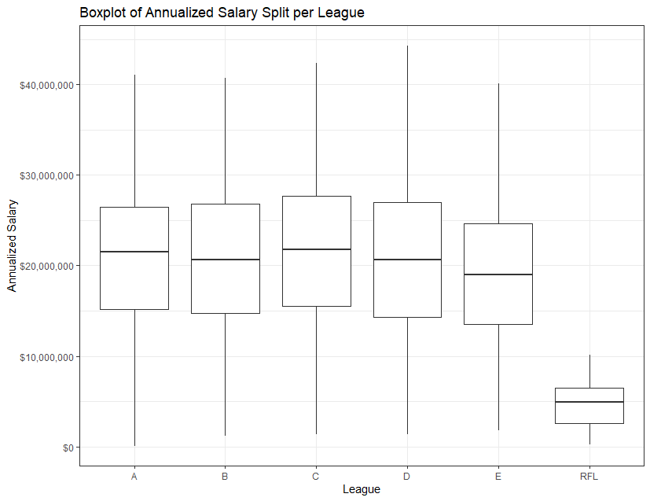
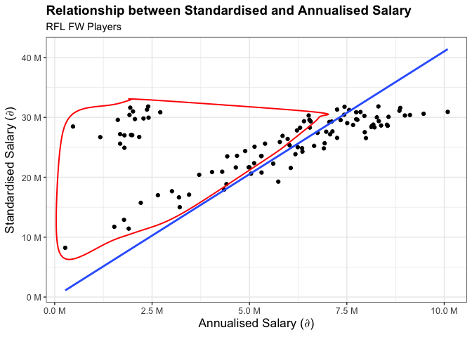
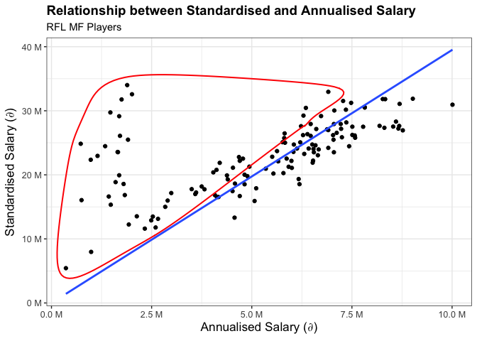
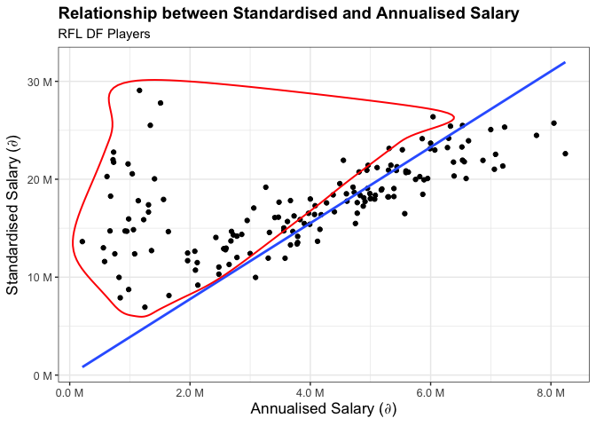

Actuarial Theory and Practice A Assignment
==========================================

By Aidan Yeoh, Alex Zhu, Annie Zhu, Matthew Winfred, Rosie Tao

1.  Background
2.  Data Cleaning Steps
3.  Modelling Steps
4.  Economic Impact Steps
5.  Conclusion

Modelling Steps
===============


Player Rating Model
-------------------

Our team is chosen from a pool of RFL players exclusively to prevent
language, cultural and political barriers from impeding overall team
cohesion (Malesky, Saiegh 2014). This selection consists of 5 forwards,
7 midfielders, 7 defenders, and 3 goalkeepers. The modelling of
individual player ratings assumes the following:

-   Salaries of league players are reflective of their skill level.
-   The attributes relevant in determining skill level are
    position-specific. Thus, player ratings for each position should be
    modelled individually.
-   Player performance in leagues translates to tournaments.
-   The level of play is consistent across leagues.

Although player salary is the assumed player rating metric, exploratory
analysis shows that salaries in RFL deviate noticeably compared to other
leagues despite RFL players delivering similar performances. Thus, the
use of a model linking player attributes to a standardised salary figure
is necessary.

**TODO: ADD CODE** 

To develop a predictive model linking player attributes to salaries, the
evaluation criteria of validation-set error is used. The non-RFL league
player data is split into a 90% training set and 10% test set. Several
candidate models are then fitted, and their corresponding validation-set
error computed. Note that:

-   Model fitting occurred independently for each position (FW, DF, MF,
    GK).
-   Goalkeepers are modelled only using goalkeeping data. Here, it is
    assumed that goalkeepers do not require the same level of attacking,
    passing etc. as other positions, and that goalkeeping specific
    skills are their most important attributes.


The selected player-rating model is a gradient boosting model (GBM)
trained on the non-RFL player league due to its higher predictive
performance (at the cost of less interpretability). The four boosting
models utilise the following parameters:

-   An interaction depth of 1 resulting in each tree becoming a stump.
    This leads to a more interpretable additive model.
-   A shrinkage parameter of 0.01 which is sufficiently low for
    predictive needs.
-   The number of trees is calculated using 10-fold cross-validation
    error. As a large number of trees will lead to overfitting and a
    small number of trees will be inflexible, the number of trees that
    corresponds to the lowest cross-validation error is selected.

``` r
#FW Player Rating Model
gbmFit.param_FW <- gbm(Annualized_Salary ~., data = cor_df_merge[(cor_df_merge['League'] != "RFL") & (cor_df_merge['Pos_new'] == "FW"),-c(19,20,21,22,23)], distribution = "gaussian", cv.fold = 10, n.trees = 3000, interaction.depth = 1, shrinkage = 0.01)
#MF Player Rating Model
gbmFit.param_MF <- gbm(Annualized_Salary ~., data = cor_df_merge[(cor_df_merge['League'] != "RFL") & (cor_df_merge['Pos_new'] == "MF"),-c(19,20,21,22,23)], distribution = "gaussian", cv.fold = 10, n.trees = 3000, interaction.depth = 1, shrinkage = 0.01)
#DF Player Rating Model
gbmFit.param_DF <- gbm(Annualized_Salary ~., data = cor_df_merge[(cor_df_merge['League'] != "RFL") & (cor_df_merge['Pos_new'] == "DF"),-c(19,20,21,22,23)], distribution = "gaussian", cv.fold = 10, n.trees = 3000, interaction.depth = 1, shrinkage = 0.01)
#GK Player Rating Model
gbmFit.param_GK <- gbm(Annualized_Salary ~., data = gk_df[(gk_df['League'] != "RFL"),-c(16,17,18,19,20)], distribution = "gaussian", cv.fold = 10, n.trees = 3000, interaction.depth = 1, shrinkage = 0.01)
```

To optimise the number of trees in the GBMs, CV error as a function of
number of trees is plotted below. Note that the green and black lines
represent test error and training error respectively.

**TODO: Add title to graphs**

``` r
par(mfrow = c(2,2))
FW_cv <- gbm.perf(gbmFit.param_FW, method = "cv")
MF_cv <- gbm.perf(gbmFit.param_MF, method = "cv")
DF_cv <- gbm.perf(gbmFit.param_DF, method = "cv")
GK_cv <- gbm.perf(gbmFit.param_GK, method = "cv")
```


Player Selection
----------------

Our goal is to enlist the most cost-efficient RFL players for player
selection that maximise economic impact. These players exhibit the
highest standardised-to-annualised salary ratios, delivering high
performance at low cost. However, player selection is restricted to the
top 25% highest-paid players to meet our FSA performance objectives.
Without this additional restriction, sufficient competitiveness is not
achieved.

``` r
#FW
FW_plot_data <- data.frame(cbind(Standardised_Salary = gbm.predict_FW[(df['League'] == "RFL") & (cor_df_merge['Pos_new'] == "FW")], Annualised_Salary = df$Annualized_Salary[(df['League'] == "RFL") & (cor_df_merge['Pos_new'] == "FW")]))
FW_select <- FW_plot_data[(gbm.predict_FW[(df['League'] == "RFL") & (cor_df_merge['Pos_new'] == "FW")]/df$Annualized_Salary[(df['League'] == "RFL") & (cor_df_merge['Pos_new'] == "FW")] > 4.41),]

ggplot(FW_plot_data, aes(x = Annualised_Salary, y = Standardised_Salary)) +
    geom_point()+
    theme_bw()+
    geom_smooth(method=lm, se = FALSE, formula=y~x-1)+
    geom_encircle(data = FW_select, color = "red", size = 2, expand = 0.03)+
    labs(x = paste0("Annualised Salary (",expression(partialdiff)), y = "Standardised Salary (∂)", title = "Relationship between Standardised and Annualised Salary", subtitle = "RFL FW Players")+
    theme(axis.text=element_text(size=9.5), axis.title=element_text(size=13, face = "bold"), plot.title = element_text(size=14, face = "bold"))+
    scale_y_continuous(labels = scales::unit_format(unit = "M", scale = 1e-6))+
    scale_x_continuous(labels = scales::unit_format(unit = "M", scale = 1e-6))
```



``` r
#MF
MF_plot_data <- data.frame(cbind(Standardised_Salary = gbm.predict_MF[(df['League'] == "RFL") & (cor_df_merge['Pos_new'] == "MF")], Annualised_Salary = df$Annualized_Salary[(df['League'] == "RFL") & (cor_df_merge['Pos_new'] == "MF")]))
MF_select <- MF_plot_data[
    (gbm.predict_MF[(df['League'] == "RFL") & (cor_df_merge['Pos_new'] == "MF")]/df$Annualized_Salary[(df['League'] == "RFL") & (cor_df_merge['Pos_new'] == "MF")]>4.4),]

ggplot(MF_plot_data, aes(x = Annualised_Salary, y = Standardised_Salary)) +
    geom_point()+
    theme_bw()+
    geom_smooth(method=lm, se = FALSE, formula=y~x-1)+
    geom_encircle(data = MF_select, color = "red", size = 2, expand = 0.03)+
    labs(x = "Annualised Salary (∂)", y = "Standardised Salary (∂)", title = "Relationship between Standardised and Annualised Salary", subtitle = "RFL MF Players")+
    theme(axis.text=element_text(size=9.5), axis.title=element_text(size=13, face = "bold"), plot.title = element_text(size=14, face = "bold"))+
    scale_y_continuous(labels = scales::unit_format(unit = "M", scale = 1e-6))+
    scale_x_continuous(labels = scales::unit_format(unit = "M", scale = 1e-6))
```



``` r
#DF
DF_plot_data <- data.frame(cbind(Standardised_Salary = gbm.predict_DF[(df['League'] == "RFL") & (cor_df_merge['Pos_new'] == "DF")], Annualised_Salary = df$Annualized_Salary[(df['League'] == "RFL") & (cor_df_merge['Pos_new'] == "DF")]))
DF_select <- DF_plot_data[(gbm.predict_DF[(df['League'] == "RFL") & (cor_df_merge['Pos_new'] == "DF")]/df$Annualized_Salary[(df['League'] == "RFL") & (cor_df_merge['Pos_new'] == "DF")] > 4.35),]

ggplot(DF_plot_data, aes(x = Annualised_Salary, y = Standardised_Salary)) +
    geom_point()+
    theme_bw()+
    geom_smooth(method=lm, se = FALSE, formula=y~x-1)+
    geom_encircle(data = DF_select, color = "red", size = 2, expand = 0.03)+
    labs(x = "Annualised Salary (∂)", y = "Standardised Salary (∂)", title = "Relationship between Standardised and Annualised Salary", subtitle = "RFL DF Players")+
    theme(axis.text=element_text(size=9.5), axis.title=element_text(size=13, face = "bold"), plot.title = element_text(size=14, face = "bold"))+
    scale_y_continuous(labels = scales::unit_format(unit = "M", scale = 1e-6))+
    scale_x_continuous(labels = scales::unit_format(unit = "M", scale = 1e-6))
```



``` r
#GK
GK_plot_data <- data.frame(cbind(Standardised_Salary = gbm.predict_GK[(df['League'] == "RFL")], Annualised_Salary = gk_df$Annualized_Salary[(df['League'] == "RFL")]))
GK_select <- GK_plot_data[(gbm.predict_GK[(df['League'] == "RFL")]/gk_df$Annualized_Salary[(df['League'] == "RFL")] > 1),]

ggplot(GK_plot_data, aes(x = Annualised_Salary, y = Standardised_Salary)) +
    geom_point()+
    theme_bw()+
    geom_smooth(method=lm, se = FALSE, formula=y~x-1)+
    geom_encircle(data = GK_select, color = "red", size = 2, expand = 0.03)+
    labs(x = "Annualised Salary (∂)", y = "Standardised Salary (∂)", title = "Relationship between Standardised and Annualised Salary", subtitle = "RFL GK Players")+
    theme(axis.text=element_text(size=9.5), axis.title=element_text(size=13, face = "bold"), plot.title = element_text(size=14, face = "bold"))+
    scale_y_continuous(labels = scales::unit_format(unit = "M", scale = 1e-6))+
    scale_x_continuous(labels = scales::unit_format(unit = "M", scale = 1e-6))
```

    ## Warning: Removed 395 rows containing non-finite values (stat_smooth).

    ## Warning: Removed 395 rows containing missing values (geom_point).

    ## Warning: Removed 395 rows containing missing values (geom_encircle).


``` r
model_data <- read.csv("data/match_model.csv")

model_data$Outcome <-ifelse(model_data$Outcome == 'Win',1,0)


#model_data$Outcome[model_data$Outcome == "Win"] <- 1
#model_data$Outcome[model_data$Outcome == "Lose"] <- 0
model_data$Outcome <- as.numeric(model_data$Outcome)
summary(model_data)
model_data <- as.data.frame(model_data)

summary(select(model_data, -c("Rank_A","Rank_B","Name_A","Name_B")))

glm_mod <- glm(Outcome ~ ., data = select(model_data, -c("Rank_A","Rank_B","Name_A","Name_B")), family = binomial())
summary(glm_mod)

#Fit gradient booster to link scores with match outcomes
gbmMatch_param <- gbm(Outcome ~., data = model_data[,-c(2,3,4,5)], distribution = "bernoulli", cv.fold = 10, n.trees = 3000, interaction.depth = 1, shrinkage = 0.01)
gbmMatch_param


min_match_param <- which.min(gbmMatch_param$cv.error)
min_match_param
gbm.perf(gbmMatch_param, method = "cv")

gbm_match <- gbm(Outcome ~., data = model_data[,-c(2,3,4,5)], distribution = "bernoulli", n.trees = min_match_param, interaction.depth = 1, shrinkage = 0.01)

summary(gbm_match)

gbm.match.predict = predict(gbm_match, newdata = model_data[,-c(1,2,3,4,5)], n.trees = min_match_param, type = "response")

mean(gbm.match.predict[1:246])
mean(gbm.match.predict[247:492])


# Raritian players updated table ------------------------------------------
column.names <- c('Player','Annualized_Salary','Expected_Salary', 'Pos_new', 'Salary_Ratio')
select.quantile <- 0

# gbm.vector <- c(gbm.predict_DF,gbm.predict_FW,gbm.predict_GK,gbm.predict_MF)
player.names <- cor_df_merge[,c('Player','Annualized_Salary','Pos_new','Nation')]

#Field players
player.salary <- cbind(player.names, gbm.predict_DF)
player.salary <- cbind(player.salary, gbm.predict_MF)
player.salary <- cbind(player.salary, gbm.predict_FW)

#Filter out RFL player

rarita.players <- player.salary %>% filter(Nation == 'Rarita')

rarita.mf <- rarita.players %>%
    filter(Pos_new == 'MF') %>%
    filter(quantile(Annualized_Salary, select.quantile) < Annualized_Salary)%>%
    select(Player, Annualized_Salary, gbm.predict_MF, Pos_new)%>%
    mutate(salary.ratio = gbm.predict_MF/Annualized_Salary)%>%
    arrange(desc(salary.ratio))

rarita.df <- rarita.players %>%
    filter(Pos_new == 'DF') %>%
    filter(quantile(Annualized_Salary, select.quantile) < Annualized_Salary)%>%
    select(Player, Annualized_Salary, gbm.predict_DF, Pos_new)%>%
    mutate(salary.ratio = gbm.predict_DF/Annualized_Salary)%>%
    arrange(desc(salary.ratio))

rarita.fw <- rarita.players %>%
    filter(Pos_new == 'FW') %>%
    filter(quantile(Annualized_Salary, select.quantile) < Annualized_Salary) %>%
    select(Player, Annualized_Salary, gbm.predict_FW, Pos_new)%>%
    mutate(salary.ratio = gbm.predict_FW/Annualized_Salary)%>%
    arrange(desc(salary.ratio))

#Goalkeepers
goalkeepers <- gk_df[,c('Player','Annualized_Salary','Nation')]
gk.salary <- cbind(goalkeepers, gbm.predict_GK)
rarita.gk <- gk.salary %>%
    filter(Nation == 'Rarita')%>%
    filter(quantile(Annualized_Salary, select.quantile) < Annualized_Salary)%>%
    select(Player, Annualized_Salary, gbm.predict_GK)%>%
    mutate(salary.ratio = gbm.predict_GK/Annualized_Salary)%>%
    arrange(desc(salary.ratio))


colnames(rarita.df) <- column.names
colnames(rarita.mf) <- column.names
colnames(rarita.fw) <- column.names
rarita.gk <- cbind(rarita.gk, Pos_new = rep(c("GK")))
rarita.gk <- rarita.gk[,c(1,2,3,5,4)]
colnames(rarita.gk) <- column.names

#Make football team
#pick 3 goalkeepers, 7 df, 7 mf, 5fw

national.team <- rarita.gk[1:3,]
national.team <- rbind(national.team, rarita.df[1:7,])
national.team <- rbind(national.team, rarita.mf[1:7,])
national.team <- rbind(national.team, rarita.fw[1:5,])


#PDP graphs
par.df.DF <- partial(gbmFit_DF, pred.var = c('Expected_xG'), n.trees = min_DF)
par.df.DF <- partial(gbmFit_DF, pred.var = c('xA'), n.trees = min_DF)
par.df.DF <- partial(gbmFit_DF, pred.var = c('Tackles_Tkl'), n.trees = min_DF)
autoplot(par.df.DF, contour = TRUE)

total_score <- team_stats$FW_Score*2/11 + team_stats$MF_Score*4/11 + team_stats$DF_Score*4/11 + team_stats$GK_Score*1/11


national.team.stats <- national.team %>%
    group_by(Pos_new) %>%
    summarise(Score = mean(Expected_Salary))


national.team.stats[1,2]*1/11+ national.team.stats[2,2]*4/11 + national.team.stats[3,2]*4/11 + national.team.stats[4,2]*2/11
15151245*1/11+ 19606225*4/11 + 22892307*4/11 + 24088798*2/11


final.national.team <- national.team.stats%>%
    add_row(Pos_new = "Total", Score = (national.team.stats[1,2]*1/11 
                                        + national.team.stats[2,2]*4/11 + national.team.stats[3,2]*4/11 + 
                                            national.team.stats[4,2]*2/11))

national.team.matchups <- read.csv("data/bad_team.csv")


national.team.predict = predict(gbm_match, newdata = national.team.matchups[,-c(1,2)], n.trees = min_match_param, type = "response")

national.team.matchups <- cbind(national.team.matchups, Probs = national.team.predict)
```

``` r
#Our team vs [18,23],[12,17],[6,11],[1,5]

set.seed(1)
#Probability that our team is in the top 10 at least once within 5 years
prob_top10_5yrs <- c()
for (i in 1:1000) {
    #successful outcome
    sim_counter <- 0
    #Calculate a single probability
    for (j in 1:1000) {
        win_two_match_prob <- national.team.matchups[floor(runif(5, min = 18, max = 24)),"Probs"]*national.team.matchups[floor(runif(5, min = 12, max = 17)),"Probs"]
        #How many times I become top 10 in 5 yrs
        count <- 0
        
        for (k in 1:5) {
            count <- count + rbinom(1, 1, win_two_match_prob[k])
        }
        
        if (count >= 1) {
            sim_counter <- sim_counter + 1
        }
    }
    
    prob_top10_5yrs[i] <- sim_counter/1000
}
hist(prob_top10_5yrs)

prob_top10_5yrs.df <- data.frame(probs = prob_top10_5yrs)

#CI of top 10
mean(prob_top10_5yrs) - qnorm(0.975, 0, 1) * sd(prob_top10_5yrs) / sqrt(1000)
mean(prob_top10_5yrs) + qnorm(0.975, 0, 1) * sd(prob_top10_5yrs) / sqrt(1000)


ggplot(prob_top10_5yrs.df)+
    geom_histogram(aes(x = probs, y = ..density..), color = "black", fill="#5662d1", bins = 30)+
    labs(x = "Probability of attaining FSA Top 10 in 5 years", y = "Density", title = "Distribution of Simulated Probability", subtitle = "FSA Top 10 in 5 years")+
    theme_bw() +
    theme(axis.text=element_text(size=9.5), axis.title=element_text(size=13, face = "bold"), plot.title = element_text(size=16, face = "bold"), plot.subtitle=element_text(size=13))

set.seed(1)
#Probability that our team is in the top 10 for the majority of the time within 5 years
prob_top10_5yrs_majority <- c()
for (i in 1:1000) {
    #successful outcome
    sim_counter <- 0
    #Calculate a single probability
    for (j in 1:1000) {
        win_two_match_prob <- national.team.matchups[floor(runif(5, min = 18, max = 24)),"Probs"]*national.team.matchups[floor(runif(5, min = 12, max = 18)),"Probs"]
        #How many times I become top 10 in 5 yrs
        count <- 0
        
        for (k in 1:5) {
            count <- count + rbinom(1, 1, win_two_match_prob[k])
        }
        
        if (count >= 3) {
            sim_counter <- sim_counter + 1
        }
    }
    
    prob_top10_5yrs_majority[i] <- sim_counter/1000
}
hist(prob_top10_5yrs_majority)


set.seed(1)
#Probability that our team wins the championship at least once within 10 years
prob_win_10yrs <- c()
for (i in 1:1000) {
    #successful outcome
    sim_counter <- 0
    #Calculate a single probability
    for (j in 1:1000) {
        win_prob <- national.team.matchups[floor(runif(10, min = 18, max = 24)),"Probs"]*national.team.matchups[floor(runif(10, min = 12, max = 18)),"Probs"]*national.team.matchups[floor(runif(10, min = 6, max = 12)),"Probs"]*national.team.matchups[floor(runif(10, min = 1, max = 6)),"Probs"]
        #How many times I win
        count <- 0
        
        for (k in 1:10) {
            count <- count + rbinom(1, 1, win_prob[k])
        }
        
        if (count >= 1) {
            sim_counter <- sim_counter + 1
        }
    }
    
    prob_win_10yrs[i] <- sim_counter/1000
}
hist(prob_win_10yrs)

#CI of winning prob
mean(prob_win_10yrs) - qnorm(0.975, 0, 1) * sd(prob_win_10yrs) / sqrt(1000)
mean(prob_win_10yrs) + qnorm(0.975, 0, 1) * sd(prob_win_10yrs) / sqrt(1000)

prob_win_10yrs.df <- data.frame(probs = prob_win_10yrs)


ggplot(prob_win_10yrs.df)+
    geom_histogram(aes(x = probs, y = ..density..), color = "black", fill="#5662d1", bins = 30)+
    labs(x = "Probability of winning FSA Championship in 10 years", y = "Density", title = "Distribution of Simulated Probability", subtitle = "FSA Championship in 10 years")+
    theme_bw() +
    theme(axis.text=element_text(size=9.5), axis.title=element_text(size=13, face = "bold"), plot.title = element_text(size=16, face = "bold"), plot.subtitle=element_text(size=13))


#Probability thresholds over time - monitoring performance for the at least one win within 10 years
set.seed(1)
prob_win_10yrs_benchmark <- c()
for (i in 1:10) {
    sim_counter <- 0
    #Calculate a single probability benchmark
    for (j in 1:1000) {
        win_prob <- national.team.matchups[floor(runif(i, min = 18, max = 24)),"Probs"]*national.team.matchups[floor(runif(i, min = 12, max = 18)),"Probs"]*national.team.matchups[floor(runif(i, min = 6, max = 12)),"Probs"]*national.team.matchups[floor(runif(i, min = 1, max = 6)),"Probs"]
        #How many times I win
        count <- 0
        
        for (k in 1:i) {
            count <- count + rbinom(1, 1, win_prob[k])
        }
        
        if (count >= 1) {
            sim_counter <- sim_counter + 1
        }
    } 
    prob_win_10yrs_benchmark[i] <- sim_counter/1000
}

prob_win_10yrs_benchmark <- prob_win_10yrs_benchmark - (prob_win_10yrs_benchmark[10]-0.7)


#Probability thresholds over time - monitoring performance for the at least one top 10 within 5 years
set.seed(1)
prob_top10_5yrs_benchmark <- c()
for (i in 1:5) {
    sim_counter <- 0
    #Calculate a single probability benchmark
    for (j in 1:1000) {
        win_prob <- national.team.matchups[floor(runif(i, min = 18, max = 24)),"Probs"]*national.team.matchups[floor(runif(i, min = 12, max = 18)),"Probs"]
        #How many times I become top 10 in 5 yrs
        count <- 0
        
        for (k in 1:i) {
            count <- count + rbinom(1, 1, win_prob[k])
        }
        
        if (count >= 1) {
            sim_counter <- sim_counter + 1
        }
    } 
    prob_top10_5yrs_benchmark[i] <- sim_counter/1000
}

prob_top10_5yrs_benchmark <- prob_top10_5yrs_benchmark - (prob_top10_5yrs_benchmark[5]-0.85)


ten.year.bm <- data.frame(x = seq(2022,2031),
                           y = sort(prob_win_10yrs_benchmark, TRUE))

five.year.bm <- data.frame(x = seq(2022,2026),
                           y = sort(prob_top10_5yrs_benchmark, TRUE))
```

``` r
#Set xend and yend
ten.year.bm$xend <- seq(2023,2032)
ten.year.bm$yend <- ten.year.bm$y

five.year.bm$xend <- seq(2023,2027)
five.year.bm$yend <- five.year.bm$y

ggplot(ten.year.bm)+
    geom_segment(aes(x = x, y = y, xend = xend, yend = yend), color = 'royalblue', cex = 1)+
    labs(title = "Competitive Benchmark Probabilities", subtitle = 'Probability of Winning FSA over remaining years',
         x = "Current Year", y = "Probability")+
    scale_y_continuous(breaks = seq(0,1,0.1), limits = c(0,1))+
    scale_x_continuous(breaks = seq(2022,2032,1), limits = c(2022,2032))+
    theme_bw()+
    theme(axis.text=element_text(size=9.5), axis.title=element_text(size=13, face = "bold"), plot.title = element_text(size=14, face = "bold"))
    

ggplot(five.year.bm)+
    geom_segment(aes(x = x, y = y, xend = xend, yend = yend), color = 'royalblue', cex = 1)+
    labs(title = "Competitive Benchmark Probabilities", subtitle = 'Probability of Placing in the Top 10 over remaining years',
         x = "Current Year", y = "Probability")+
    scale_y_continuous(breaks = seq(0,1,0.1), limits = c(0,1))+
    scale_x_continuous(breaks = seq(2022,2027,1), limits = c(2022,2027))+
    theme_bw()+
    theme(axis.text=element_text(size=9.5), axis.title=element_text(size=13, face = "bold"), plot.title = element_text(size=14, face = "bold"))
    
#Cost of league (player salaries) - ECON model
sum(cor_df$Annualized_Salary[(df$League == "RFL") & (df$Year == "2020")]) + sum(gk_df$Annualized_Salary[(gk_df$League == "RFL")])/2

#Plots for player selection
#MF
MF_plot_data <- data.frame(cbind(Standardised_Salary = gbm.predict_MF[(df['League'] == "RFL") & (cor_df_merge['Pos_new'] == "MF")], Annualised_Salary = df$Annualized_Salary[(df['League'] == "RFL") & (cor_df_merge['Pos_new'] == "MF")]))
MF_select <- MF_plot_data[
    (gbm.predict_MF[(df['League'] == "RFL") & (cor_df_merge['Pos_new'] == "MF")]/df$Annualized_Salary[(df['League'] == "RFL") & (cor_df_merge['Pos_new'] == "MF")]>4.4),]

ggplot(MF_plot_data, aes(x = Annualised_Salary, y = Standardised_Salary)) +
    geom_point()+
    theme_bw()+
    geom_smooth(method=lm, se = FALSE, formula=y~x-1)+
    geom_encircle(data = MF_select, color = "red", size = 2, expand = 0.03)+
    labs(x = "Annualised Salary (∂)", y = "Standardised Salary (∂)", title = "Relationship between Standardised and Annualised Salary", subtitle = "RFL MF Players")+
    theme(axis.text=element_text(size=9.5), axis.title=element_text(size=13, face = "bold"), plot.title = element_text(size=14, face = "bold"))+
    scale_y_continuous(labels = scales::unit_format(unit = "M", scale = 1e-6))+
    scale_x_continuous(labels = scales::unit_format(unit = "M", scale = 1e-6))

#DF
DF_plot_data <- data.frame(cbind(Standardised_Salary = gbm.predict_DF[(df['League'] == "RFL") & (cor_df_merge['Pos_new'] == "DF")], Annualised_Salary = df$Annualized_Salary[(df['League'] == "RFL") & (cor_df_merge['Pos_new'] == "DF")]))
DF_select <- DF_plot_data[(gbm.predict_DF[(df['League'] == "RFL") & (cor_df_merge['Pos_new'] == "DF")]/df$Annualized_Salary[(df['League'] == "RFL") & (cor_df_merge['Pos_new'] == "DF")] > 4.35),]

ggplot(DF_plot_data, aes(x = Annualised_Salary, y = Standardised_Salary)) +
    geom_point()+
    theme_bw()+
    geom_smooth(method=lm, se = FALSE, formula=y~x-1)+
    geom_encircle(data = DF_select, color = "red", size = 2, expand = 0.03)+
    labs(x = "Annualised Salary (∂)", y = "Standardised Salary (∂)", title = "Relationship between Standardised and Annualised Salary", subtitle = "RFL DF Players")+
    theme(axis.text=element_text(size=9.5), axis.title=element_text(size=13, face = "bold"), plot.title = element_text(size=14, face = "bold"))+
    scale_y_continuous(labels = scales::unit_format(unit = "M", scale = 1e-6))+
    scale_x_continuous(labels = scales::unit_format(unit = "M", scale = 1e-6))

#FW
FW_plot_data <- data.frame(cbind(Standardised_Salary = gbm.predict_FW[(df['League'] == "RFL") & (cor_df_merge['Pos_new'] == "FW")], Annualised_Salary = df$Annualized_Salary[(df['League'] == "RFL") & (cor_df_merge['Pos_new'] == "FW")]))
FW_select <- FW_plot_data[(gbm.predict_FW[(df['League'] == "RFL") & (cor_df_merge['Pos_new'] == "FW")]/df$Annualized_Salary[(df['League'] == "RFL") & (cor_df_merge['Pos_new'] == "FW")] > 4.41),]

ggplot(FW_plot_data, aes(x = Annualised_Salary, y = Standardised_Salary)) +
    geom_point()+
    theme_bw()+
    geom_smooth(method=lm, se = FALSE, formula=y~x-1)+
    geom_encircle(data = FW_select, color = "red", size = 2, expand = 0.03)+
    labs(x = "Annualised Salary (∂)", y = "Standardised Salary (∂)", title = "Relationship between Standardised and Annualised Salary", subtitle = "RFL FW Players")+
    theme(axis.text=element_text(size=9.5), axis.title=element_text(size=13, face = "bold"), plot.title = element_text(size=14, face = "bold"))+
    scale_y_continuous(labels = scales::unit_format(unit = "M", scale = 1e-6))+
    scale_x_continuous(labels = scales::unit_format(unit = "M", scale = 1e-6))

#GK
GK_plot_data <- data.frame(cbind(Standardised_Salary = gbm.predict_GK[(df['League'] == "RFL")], Annualised_Salary = gk_df$Annualized_Salary[(df['League'] == "RFL")]))
GK_select <- GK_plot_data[(gbm.predict_GK[(df['League'] == "RFL")]/gk_df$Annualized_Salary[(df['League'] == "RFL")] > 1),]

ggplot(GK_plot_data, aes(x = Annualised_Salary, y = Standardised_Salary)) +
    geom_point()+
    theme_bw()+
    geom_smooth(method=lm, se = FALSE, formula=y~x-1)+
    geom_encircle(data = GK_select, color = "red", size = 2, expand = 0.03)+
    labs(x = "Annualised Salary (∂)", y = "Standardised Salary (∂)", title = "Relationship between Standardised and Annualised Salary", subtitle = "RFL GK Players")+
    theme(axis.text=element_text(size=9.5), axis.title=element_text(size=13, face = "bold"), plot.title = element_text(size=14, face = "bold"))+
    scale_y_continuous(labels = scales::unit_format(unit = "M", scale = 1e-6))+
    scale_x_continuous(labels = scales::unit_format(unit = "M", scale = 1e-6))
```
