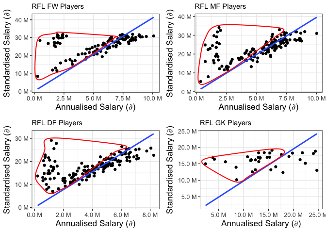
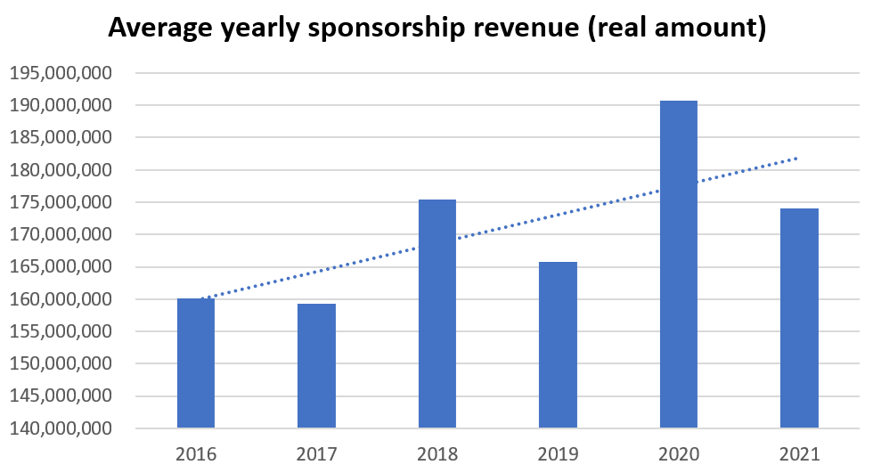
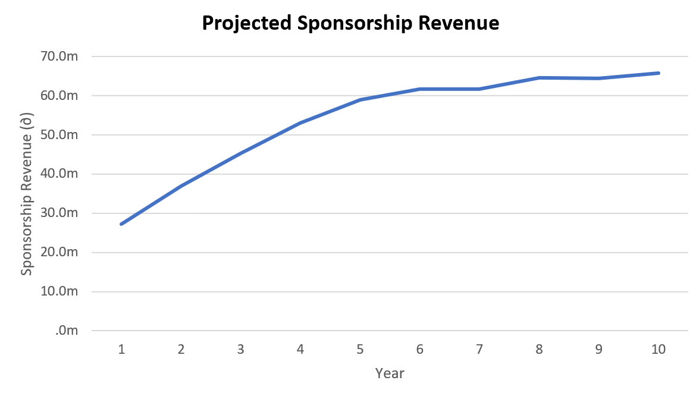
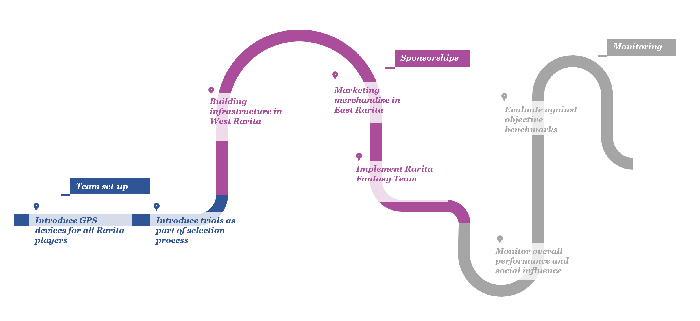

# Actuarial Theory and Practice A Assignment

By Aidan Yeoh, Alex Zhu, Annie Zhu, Matthew Winfred, Rosie Tao

# 1 Table of Contents

  - [Actuarial Theory and Practice A
    Assignment](#actuarial-theory-and-practice-a-assignment)
  - [Background](#background)
  - [Data Preprocessing](#data-preprocessing)
  - [Modelling Steps](#modelling-steps)
      - [Player Rating Model](#player-rating-model)
      - [Player Selection](#player-selection)
      - [Team Rating Model](#team-rating-model)
      - [FSA Match Simulation](#fsa-match-simulation)
      - [Competitiveness of team](#competitiveness-of-team)
      - [Limitations of Team Selection](#limitations-of-team-selection)
  - [Economic Impact](#economic-impact)
      - [Revenue & Costs](#revenue-&-costs)
      - [NPV and Sensitivity Analysis](#npv-and-sensitivity-analysis)
      - [Reserve and Investment
        Strategy](#reserve-and-investment-strategy)
      - [Broader Economic Impact](#broader-economic-impact)
  - [Implementation Plan](#implementation-plan)
  - [Risk and Risk Mitigation
    Considerations](#risk-and-risk-mitigation-considerations)
      - [Financial Risks](#financial-risks)
      - [Operational Risks](#operational-risks)
      - [Other Risks](#other-risks)
  - [Conclusion](#conclusion)
  - [References](#references)

# 2 Background

# 3 Data Preprocessing

For Data Collection and Preprocessing, we have conducted the following
steps:

1.  Excel files are converted to R via `convert_excel_to_r.R`. The file
    mainly uses `readxl` package to read excel tables of specified
    ranges.
2.  Cleaning and preparation pipelines are built in
    `R_files/merge_data.R`. This file treats merges data sets from
    different excel sheets together, manages data inconsistencies,
    imputes missing or negative values, and remove unnecessary columns.
3.  Exploratory Data Analysis are conducted in `R_files/exploratory.R`
    as well as a preliminary linear regression. Some plots from
    exploratory analysis are generated below.
4.  Further preprocessing and filtering were done in `Annie's
    preprocessing.R` and `filter_pipeline_exploratory.R` before passing
    into the modelling steps.

Below are some examples of exploratory analysis done in the model.

We can see that the Raritan Football League has a much lower Annualised
Salary compared to the other leagues.

``` r
ggplot(PLAYER_league_non_goal_salary, aes(x = League, 
                                          y = Annualized_Salary))+
    geom_boxplot()+
    labs(x = "League", y = expression(paste("Standardised Salary (",partialdiff,")")), title = "Box Plot of Annualized Salary per League")+
    theme(axis.text=element_text(size=9.5), axis.title=element_text(size=13, face = "bold"), plot.title = element_text(size=14, face = "bold"))+
    scale_y_continuous(labels = scales::unit_format(unit = "M", scale = 1e-6))
```

<!-- -->

Forward positions are shown to have higher shooting metrics, such as
`shots on target per 90 minutes`, `expected goals` and `shots total
per 90 minutes`. This position may have higher correlation with winning.

``` r
p1<- ggplot(data = PLAYER_league_non_goal_salary %>% filter(Pos_new != "GK"), aes(x = Pos_new, y = `Standard_SoT/90`)) + 
    geom_boxplot(outlier.shape = NA) + 
    coord_cartesian(ylim =  c(0, 3)) +
    labs(x = "Position")

p2<-ggplot(data = PLAYER_league_non_goal_salary %>% filter(Pos_new != "GK"), aes(x = Pos_new, y = `Expected_xG`)) + 
    geom_boxplot(outlier.shape = NA) + 
    coord_cartesian(ylim =  c(0, 1))+
    labs(x = "Position")

p3<-ggplot(data = PLAYER_league_non_goal_salary %>% filter(Pos_new != "GK"), aes(x = Pos_new, y = `Standard_Sh/90`)) + 
    geom_boxplot(outlier.shape = NA) + 
    coord_cartesian(ylim =  c(0, 5)) +
    labs(x = "Position")
grid.arrange(p1,p2,p3,ncol = 1)
```

<!-- -->

Based on the results from Linear Regression, players with low Annualized
Salary and high Predicted Salary would be the players desirable for the
Raritan Football Team.

``` r
# LINEAR REGRESSION

cols_to_remove <- c("Pos_new","Player","Nation","League","Squad")
pos_levels <- c("MF","DF","FW")

for (level in pos_levels) {
    eval(call("<-",paste0(level,"_nonRFL"),
              nonRFL %>% filter(Pos_new == level) %>% select(-all_of(cols_to_remove))))
    eval(call("<-",paste0(level,"_RFL"),
              RFL %>% filter(Pos_new == level) %>% select(-all_of(cols_to_remove))))
    eval(call("<-",paste0(level,"_nonRFL_mod"),
              glm(Annualized_Salary ~ ., data = eval(str2lang(paste0(level,"_nonRFL"))))))
    
    Predicted_Sal<- predict(eval(str2lang(paste0(level,"_nonRFL_mod"))),newdata = eval(str2lang(paste0(level,"_RFL"))))
    eval(call("<-",paste0(level,"_RFL"),
              cbind(get(paste0(level,"_RFL")),Predicted_Sal)))
    
    Diff <- eval(str2lang(paste0(level,"_RFL")))["Predicted_Sal"] - eval(str2lang(paste0(level,"_RFL")))["Annualized_Salary"]
    names(Diff) <- "Diff"
    eval(call("<-",paste0(level,"_RFL"),
              cbind(get(paste0(level,"_RFL")),Diff)))
    
    
}

par(mfrow= c(1,3))
plot(MF_RFL$Annualized_Salary,MF_RFL$Predicted_Sal, main= "MF RFL")
plot(DF_RFL$Annualized_Salary,DF_RFL$Predicted_Sal, main= "DF RFL")
plot(FW_RFL$Annualized_Salary,FW_RFL$Predicted_Sal, main= "FW RFL")
```

<!-- -->

# 4 Modelling Steps


## 4.1 Player Rating Model

Our team is chosen from a pool of RFL players exclusively to prevent
language, cultural and political barriers from impeding overall team
cohesion \[@2014MaleskySaigegh\]. This selection consists of 5 forwards,
7 midfielders, 7 defenders, and 3 goalkeepers. The modelling of
individual player ratings assumes the following:

  - Salaries of league players are reflective of their skill level.
  - The attributes relevant in determining skill level are
    position-specific. Thus, player ratings for each position should be
    modelled individually.
  - Player performance in leagues translates to tournaments.
  - The level of play is consistent across leagues.

Although player salary is the assumed player rating metric, exploratory
analysis shows that salaries in RFL deviate noticeably compared to other
leagues despite RFL players delivering similar performances. Thus, the
use of a model linking player attributes to a standardised salary figure
is necessary.

To develop a predictive model linking player attributes to salaries, the
evaluation criteria of validation-set error is used. The non-RFL league
player data is split into a 90% training set and 10% test set. Several
candidate models are then fitted, and their corresponding validation-set
error computed. Note that:

  - Model fitting occurred independently for each position (FW, DF, MF,
    GK).
  - Goalkeepers are modelled only using goalkeeping data. Here, it is
    assumed that goalkeepers do not require the same level of attacking,
    passing etc. as other positions, and that goalkeeping specific
    skills are their most important attributes.


The selected player-rating model is a gradient boosting model (GBM)
trained on the non-RFL player league due to its higher predictive
performance (at the cost of less interpretability). The four boosting
models utilise the following parameters:

  - An interaction depth of 1 resulting in each tree becoming a stump.
    This leads to a more interpretable additive model.
  - A shrinkage parameter of 0.01 which is sufficiently low for
    predictive needs.
  - The number of trees is calculated using 10-fold cross-validation
    error. As a large number of trees will lead to overfitting and a
    small number of trees will be inflexible, the number of trees that
    corresponds to the lowest cross-validation error is selected.

<!-- end list -->

``` r
#FW Player Rating Model
gbmFit.param_FW <- gbm(Annualized_Salary ~., data = cor_df_merge[(cor_df_merge['League'] != "RFL") & (cor_df_merge['Pos_new'] == "FW"),-c(19,20,21,22,23)], distribution = "gaussian", cv.fold = 10, n.trees = 3000, interaction.depth = 1, shrinkage = 0.01)
#MF Player Rating Model
gbmFit.param_MF <- gbm(Annualized_Salary ~., data = cor_df_merge[(cor_df_merge['League'] != "RFL") & (cor_df_merge['Pos_new'] == "MF"),-c(19,20,21,22,23)], distribution = "gaussian", cv.fold = 10, n.trees = 3000, interaction.depth = 1, shrinkage = 0.01)
#DF Player Rating Model
gbmFit.param_DF <- gbm(Annualized_Salary ~., data = cor_df_merge[(cor_df_merge['League'] != "RFL") & (cor_df_merge['Pos_new'] == "DF"),-c(19,20,21,22,23)], distribution = "gaussian", cv.fold = 10, n.trees = 3000, interaction.depth = 1, shrinkage = 0.01)
#GK Player Rating Model
gbmFit.param_GK <- gbm(Annualized_Salary ~., data = gk_df[(gk_df['League'] != "RFL"),-c(16,17,18,19,20)], distribution = "gaussian", cv.fold = 10, n.trees = 3000, interaction.depth = 1, shrinkage = 0.01)
```

To optimise the number of trees in the GBMs, CV error as a function of
number of trees is plotted below. Note that the green and black lines
represent test error and training error respectively.

``` r
par(mfrow = c(2,2))
FW_cv <- gbm.perf(gbmFit.param_FW, method = "cv")
title(main = "FW")
MF_cv <- gbm.perf(gbmFit.param_MF, method = "cv")
title(main = "MF")
DF_cv <- gbm.perf(gbmFit.param_DF, method = "cv")
title(main = "DF")
GK_cv <- gbm.perf(gbmFit.param_GK, method = "cv")
title(main = "GK")
```

<!-- -->

## 4.2 Player Selection

Our goal is to enlist the most cost-efficient RFL players for player
selection that maximise economic impact. These players exhibit the
highest standardised-to-annualised salary ratios, delivering high
performance at low cost. However, player selection is restricted to the
top 25% highest-paid players to meet our FSA performance objectives.
Without this additional restriction, sufficient competitiveness is not
achieved.

``` r
#FW
FW_plot_data <- data.frame(cbind(Standardised_Salary = gbm.predict_FW[(df['League'] == "RFL") & (cor_df_merge['Pos_new'] == "FW")], Annualised_Salary = df$Annualized_Salary[(df['League'] == "RFL") & (cor_df_merge['Pos_new'] == "FW")]))
FW_select <- FW_plot_data[(gbm.predict_FW[(df['League'] == "RFL") & (cor_df_merge['Pos_new'] == "FW")]/df$Annualized_Salary[(df['League'] == "RFL") & (cor_df_merge['Pos_new'] == "FW")] > 4.41),]

ggplot(FW_plot_data, aes(x = Annualised_Salary, y = Standardised_Salary)) +
    geom_point()+
    theme_bw()+
    geom_smooth(method=lm, se = FALSE, formula=y~x-1)+
    geom_encircle(data = FW_select, color = "red", size = 2, expand = 0.03)+
    labs(x = expression(paste("Annualised Salary (",partialdiff,")")), y = expression(paste("Standardised Salary (",partialdiff,")")), title = "Relationship between Standardised and Annualised Salary", subtitle = "RFL FW Players")+
    theme(axis.text=element_text(size=9.5), axis.title=element_text(size=13, face = "bold"), plot.title = element_text(size=14, face = "bold"))+
    scale_y_continuous(labels = scales::unit_format(unit = "M", scale = 1e-6))+
    scale_x_continuous(labels = scales::unit_format(unit = "M", scale = 1e-6))
```

<!-- -->

``` r
#MF
MF_plot_data <- data.frame(cbind(Standardised_Salary = gbm.predict_MF[(df['League'] == "RFL") & (cor_df_merge['Pos_new'] == "MF")], Annualised_Salary = df$Annualized_Salary[(df['League'] == "RFL") & (cor_df_merge['Pos_new'] == "MF")]))
MF_select <- MF_plot_data[
    (gbm.predict_MF[(df['League'] == "RFL") & (cor_df_merge['Pos_new'] == "MF")]/df$Annualized_Salary[(df['League'] == "RFL") & (cor_df_merge['Pos_new'] == "MF")]>4.4),]

ggplot(MF_plot_data, aes(x = Annualised_Salary, y = Standardised_Salary)) +
    geom_point()+
    theme_bw()+
    geom_smooth(method=lm, se = FALSE, formula=y~x-1)+
    geom_encircle(data = MF_select, color = "red", size = 2, expand = 0.03)+
    labs(x = expression(paste("Annualised Salary (",partialdiff,")")), y = expression(paste("Standardised Salary (",partialdiff,")")), title = "Relationship between Standardised and Annualised Salary", subtitle = "RFL MF Players")+
    theme(axis.text=element_text(size=9.5), axis.title=element_text(size=13, face = "bold"), plot.title = element_text(size=14, face = "bold"))+
    scale_y_continuous(labels = scales::unit_format(unit = "M", scale = 1e-6))+
    scale_x_continuous(labels = scales::unit_format(unit = "M", scale = 1e-6))
```

<!-- -->

``` r
#DF
DF_plot_data <- data.frame(cbind(Standardised_Salary = gbm.predict_DF[(df['League'] == "RFL") & (cor_df_merge['Pos_new'] == "DF")], Annualised_Salary = df$Annualized_Salary[(df['League'] == "RFL") & (cor_df_merge['Pos_new'] == "DF")]))
DF_select <- DF_plot_data[(gbm.predict_DF[(df['League'] == "RFL") & (cor_df_merge['Pos_new'] == "DF")]/df$Annualized_Salary[(df['League'] == "RFL") & (cor_df_merge['Pos_new'] == "DF")] > 4.35),]

ggplot(DF_plot_data, aes(x = Annualised_Salary, y = Standardised_Salary)) +
    geom_point()+
    theme_bw()+
    geom_smooth(method=lm, se = FALSE, formula=y~x-1)+
    geom_encircle(data = DF_select, color = "red", size = 2, expand = 0.03)+
    labs(x = expression(paste("Annualised Salary (",partialdiff,")")), y = expression(paste("Standardised Salary (",partialdiff,")")), title = "Relationship between Standardised and Annualised Salary", subtitle = "RFL DF Players")+
    theme(axis.text=element_text(size=9.5), axis.title=element_text(size=13, face = "bold"), plot.title = element_text(size=14, face = "bold"))+
    scale_y_continuous(labels = scales::unit_format(unit = "M", scale = 1e-6))+
    scale_x_continuous(labels = scales::unit_format(unit = "M", scale = 1e-6))
```

<!-- -->

``` r
#GK
GK_plot_data <- data.frame(cbind(Standardised_Salary = gbm.predict_GK[(df['League'] == "RFL")], Annualised_Salary = gk_df$Annualized_Salary[(df['League'] == "RFL")]))
GK_select <- GK_plot_data[(gbm.predict_GK[(df['League'] == "RFL")]/gk_df$Annualized_Salary[(df['League'] == "RFL")] > 1),]

ggplot(GK_plot_data, aes(x = Annualised_Salary, y = Standardised_Salary)) +
    geom_point()+
    theme_bw()+
    geom_smooth(method=lm, se = FALSE, formula=y~x-1)+
    geom_encircle(data = GK_select, color = "red", size = 2, expand = 0.03)+
    labs(x = expression(paste("Annualised Salary (",partialdiff,")")), y = expression(paste("Standardised Salary (",partialdiff,")")), title = "Relationship between Standardised and Annualised Salary", subtitle = "RFL GK Players")+
    theme(axis.text=element_text(size=9.5), axis.title=element_text(size=13, face = "bold"), plot.title = element_text(size=14, face = "bold"))+
    scale_y_continuous(labels = scales::unit_format(unit = "M", scale = 1e-6))+
    scale_x_continuous(labels = scales::unit_format(unit = "M", scale = 1e-6))
```

<!-- -->

Following this criteria led to a player selection for the national team
as illustrated below:


## 4.3 Team Rating Model

A team rating model is created to rate team performance and calculate
the probability that a team wins a matchup. This model:

1.  Determines a team’s position score by averaging standardised
    salaries over each player position
2.  Calculates the difference between two competing team’s position
    scores
3.  Inputs the differences in position scores
    () into a GBM that
    outputs the probability of winning the matchup
4.  Repeat the procedure between Rarita and other teams
    .

This model suggests that the differential in FW team scores is the most
significant predictor in this GBM, highlighting the necessity of strong
FW players.

``` r
gbm_match <- gbm(Outcome ~., data = model_data[,-c(2,3,4,5)], distribution = "bernoulli", n.trees = min_match_param, interaction.depth = 1, shrinkage = 0.01)
summary(gbm_match)
```

    ##                             var   rel.inf
    ## FW_Score_Dif       FW_Score_Dif 71.426665
    ## MF_Score_Dif       MF_Score_Dif  9.791857
    ## DF_Score_Dif       DF_Score_Dif  9.511791
    ## GK_Score_Dif       GK_Score_Dif  5.306472
    ## Total_Score_Dif Total_Score_Dif  3.963215

Using our selected team, we can determine the predicted probabilities of
Rarita winning their matchups.

``` r
national.team.matchups <- read.csv("data/match_model_data_rarita.csv")

national.team.predict = predict(gbm_match, newdata = national.team.matchups[,-c(1,2)], n.trees = min_match_param, type = "response")

national.team.matchups <- cbind(national.team.matchups, Probs = national.team.predict)
national.team.matchups[,c(1,2,8)]
```

    ##    ï..Name_A                  Name_B     Probs
    ## 1     Rarita          Sobianitedrucy 0.5444979
    ## 2     Rarita People's Land of Maneau 0.6417172
    ## 3     Rarita                 Nganion 0.4886620
    ## 4     Rarita                    Mico 0.5779851
    ## 5     Rarita                Quewenia 0.5976011
    ## 6     Rarita         Southern Ristan 0.6887418
    ## 7     Rarita                Galamily 0.5845329
    ## 8     Rarita              Bernepamar 0.6416346
    ## 9     Rarita         Giumle Lizeibon 0.5554569
    ## 10    Rarita      Greri Landmoslands 0.5729932
    ## 11    Rarita                  Xikong 0.5524594
    ## 12    Rarita          Manlisgamncent 0.5475640
    ## 13    Rarita                    Esia 0.6295361
    ## 14    Rarita           Byasier Pujan 0.6887418
    ## 15    Rarita                Djipines 0.6529175
    ## 16    Rarita        Leoneku Guidisia 0.6611288
    ## 17    Rarita                  Ledian 0.6456512
    ## 18    Rarita        Eastern Sleboube 0.5518967
    ## 19    Rarita                 New Uwi 0.6529175
    ## 20    Rarita           Ngoque Blicri 0.5851385
    ## 21    Rarita      Nkasland Cronestan 0.5623946
    ## 22    Rarita        Eastern Niasland 0.6887418
    ## 23    Rarita         Varijitri Isles 0.6085993

## 4.4 FSA Match Simulation

We assumed a tournament match system with 24 teams (including Rarita) at
the elimination stage of the tournament.

To calculate probabilties of fulfilling the objectives of Top 10 in 5
years and winning the FSA Championships in 10 years, we run 1000
simulations of tournament bracket outcomes to obtain a single
probability using the code block below. We then repeat this process 1000
times to generate a distribution of probabilities.

Using a similar simulation technique, we also calculated the probability
that our team is placed in

1.  top 10 for the majority of the time within 5 years
2.  wins the championship at least once within 10 years
3.  top 10 over the remaining years

<!-- end list -->

``` r
#Our team vs [18,23],[12,17],[6,11],[1,5]

set.seed(1)
#Probability that our team is in the top 10 at least once within 5 years
prob_top10_5yrs <- c()
for (i in 1:1000) {
    #successful outcome
    sim_counter <- 0
    #Calculate a single probability
    for (j in 1:1000) {
        win_two_match_prob <- national.team.matchups[floor(runif(5, min = 18, max = 24)),"Probs"]*national.team.matchups[floor(runif(5, min = 12, max = 17)),"Probs"]
        #How many times I become top 10 in 5 yrs
        count <- 0
        
        for (k in 1:5) {
            count <- count + rbinom(1, 1, win_two_match_prob[k])
        }
        
        if (count >= 1) {
            sim_counter <- sim_counter + 1
        }
    }
    
    prob_top10_5yrs[i] <- sim_counter/1000
}
```

``` r
hist(prob_top10_5yrs,
     main = "Histogram of Probability of top 10 at least once in 5 years",
     xlab = "Probability of top 10 at least once in 5 years")
```

<!-- -->

``` r
prob_top10_5yrs.df <- data.frame(probs = prob_top10_5yrs)

#CI of top 10
mean(prob_top10_5yrs) - qnorm(0.975, 0, 1) * sd(prob_top10_5yrs) / sqrt(1000)
```

    ## [1] 0.912973

``` r
mean(prob_top10_5yrs) + qnorm(0.975, 0, 1) * sd(prob_top10_5yrs) / sqrt(1000)
```

    ## [1] 0.914069

``` r
set.seed(1)
#Probability that our team is in the top 10 for the majority of the time within 5 years
prob_top10_5yrs_majority <- c()
for (i in 1:1000) {
    #successful outcome
    sim_counter <- 0
    #Calculate a single probability
    for (j in 1:1000) {
        win_two_match_prob <- national.team.matchups[floor(runif(5, min = 18, max = 24)),"Probs"]*national.team.matchups[floor(runif(5, min = 12, max = 18)),"Probs"]
        #How many times I become top 10 in 5 yrs
        count <- 0
        
        for (k in 1:5) {
            count <- count + rbinom(1, 1, win_two_match_prob[k])
        }
        
        if (count >= 3) {
            sim_counter <- sim_counter + 1
        }
    }
    
    prob_top10_5yrs_majority[i] <- sim_counter/1000
}
hist(prob_top10_5yrs_majority, 
     main = "Histogram of Probability of top 10 for the majority of time in 5 years",
     xlab = "Probability of top 10 for the majority of time in 5 years")
```

<!-- -->

``` r
set.seed(1)
#Probability that our team wins the championship at least once within 10 years
prob_win_10yrs <- c()
for (i in 1:1000) {
    #successful outcome
    sim_counter <- 0
    #Calculate a single probability
    for (j in 1:1000) {
        win_prob <- national.team.matchups[floor(runif(10, min = 18, max = 24)),"Probs"]*national.team.matchups[floor(runif(10, min = 12, max = 18)),"Probs"]*national.team.matchups[floor(runif(10, min = 6, max = 12)),"Probs"]*national.team.matchups[floor(runif(10, min = 1, max = 6)),"Probs"]
        #How many times I win
        count <- 0
        
        for (k in 1:10) {
            count <- count + rbinom(1, 1, win_prob[k])
        }
        
        if (count >= 1) {
            sim_counter <- sim_counter + 1
        }
    }
    
    prob_win_10yrs[i] <- sim_counter/1000
}
hist(prob_win_10yrs,
     main = "Histogram of Probability of winning at least once in 10 years",
     xlab = "Probability of winning at least once in 10 years")
```

<!-- -->

``` r
#CI of winning prob
mean(prob_win_10yrs) - qnorm(0.975, 0, 1) * sd(prob_win_10yrs) / sqrt(1000)
```

    ## [1] 0.7580336

``` r
mean(prob_win_10yrs) + qnorm(0.975, 0, 1) * sd(prob_win_10yrs) / sqrt(1000)
```

    ## [1] 0.7597124

``` r
prob_win_10yrs.df <- data.frame(probs = prob_win_10yrs)

#Probability thresholds over time - monitoring performance for the at least one win within 10 years
set.seed(1)
prob_win_10yrs_benchmark <- c()
for (i in 1:10) {
    sim_counter <- 0
    #Calculate a single probability benchmark
    for (j in 1:1000) {
        win_prob <- national.team.matchups[floor(runif(i, min = 18, max = 24)),"Probs"]*national.team.matchups[floor(runif(i, min = 12, max = 18)),"Probs"]*national.team.matchups[floor(runif(i, min = 6, max = 12)),"Probs"]*national.team.matchups[floor(runif(i, min = 1, max = 6)),"Probs"]
        #How many times I win
        count <- 0
        
        for (k in 1:i) {
            count <- count + rbinom(1, 1, win_prob[k])
        }
        
        if (count >= 1) {
            sim_counter <- sim_counter + 1
        }
    } 
    prob_win_10yrs_benchmark[i] <- sim_counter/1000
}

prob_win_10yrs_benchmark <- prob_win_10yrs_benchmark - (prob_win_10yrs_benchmark[10]-0.7)


#Probability thresholds over time - monitoring performance for the at least one top 10 within 5 years
set.seed(1)
prob_top10_5yrs_benchmark <- c()
for (i in 1:5) {
    sim_counter <- 0
    #Calculate a single probability benchmark
    for (j in 1:1000) {
        win_prob <- national.team.matchups[floor(runif(i, min = 18, max = 24)),"Probs"]*national.team.matchups[floor(runif(i, min = 12, max = 18)),"Probs"]
        #How many times I become top 10 in 5 yrs
        count <- 0
        
        for (k in 1:i) {
            count <- count + rbinom(1, 1, win_prob[k])
        }
        
        if (count >= 1) {
            sim_counter <- sim_counter + 1
        }
    } 
    prob_top10_5yrs_benchmark[i] <- sim_counter/1000
}

prob_top10_5yrs_benchmark <- prob_top10_5yrs_benchmark - (prob_top10_5yrs_benchmark[5]-0.85)


ten.year.bm <- data.frame(x = seq(2022,2031),
                           y = sort(prob_win_10yrs_benchmark, TRUE))

five.year.bm <- data.frame(x = seq(2022,2026),
                           y = sort(prob_top10_5yrs_benchmark, TRUE))
```

## 4.5 Competitiveness of team

Based on our selected national team, we can see that the national team
comfortably exceeds the performance constraints. Here, the 95%
confidence interval for the probabilities of attaining an FSA
championship top-10 in 5 years and winning the FSA championship in 10
years is (91.540%, 91.647%) and (76.332%, 76.500%) respectively. These
are well above the corresponding 85% and 70% thresholds established
earlier.

``` r
par(mfrow = c(1,2))
ggplot(prob_top10_5yrs.df)+
    geom_histogram(aes(x = probs, y = ..density..), color = "black", fill="#5662d1", bins = 30)+
    labs(x = "Probability of attaining FSA Top 10 in 5 years", y = "Density", title = "Distribution of Simulated Probability", subtitle = "FSA Top 10 in 5 years")+
    theme_bw() +
    theme(axis.text=element_text(size=9.5), axis.title=element_text(size=13, face = "bold"), plot.title = element_text(size=16, face = "bold"), plot.subtitle=element_text(size=13))
```

<!-- -->

``` r
ggplot(prob_win_10yrs.df)+
    geom_histogram(aes(x = probs, y = ..density..), color = "black", fill="#5662d1", bins = 30)+
    labs(x = "Probability of winning FSA Championship in 10 years", y = "Density", title = "Distribution of Simulated Probability", subtitle = "FSA Championship in 10 years")+
    theme_bw() +
    theme(axis.text=element_text(size=9.5), axis.title=element_text(size=13, face = "bold"), plot.title = element_text(size=16, face = "bold"), plot.subtitle=element_text(size=13))
```

<!-- -->

``` r
#Set xend and yend
ten.year.bm$xend <- seq(2023,2032)
ten.year.bm$yend <- ten.year.bm$y

five.year.bm$xend <- seq(2023,2027)
five.year.bm$yend <- five.year.bm$y

ggplot(ten.year.bm)+
    geom_segment(aes(x = x, y = y, xend = xend, yend = yend), color = 'royalblue', cex = 1)+
    labs(title = "Competitive Benchmark Probabilities", subtitle = 'Probability of Winning FSA over remaining years',
         x = "Current Year", y = "Probability")+
    scale_y_continuous(breaks = seq(0,1,0.1), limits = c(0,1))+
    scale_x_continuous(breaks = seq(2022,2032,1), limits = c(2022,2032))+
    theme_bw()+
    theme(axis.text=element_text(size=9.5), axis.title=element_text(size=13, face = "bold"), plot.title = element_text(size=14, face = "bold"))
```

<!-- -->

``` r
ggplot(five.year.bm)+
    geom_segment(aes(x = x, y = y, xend = xend, yend = yend), color = 'royalblue', cex = 1)+
    labs(title = "Competitive Benchmark Probabilities", subtitle = 'Probability of Placing in the Top 10 over remaining years',
         x = "Current Year", y = "Probability")+
    scale_y_continuous(breaks = seq(0,1,0.1), limits = c(0,1))+
    scale_x_continuous(breaks = seq(2022,2027,1), limits = c(2022,2027))+
    theme_bw()+
    theme(axis.text=element_text(size=9.5), axis.title=element_text(size=13, face = "bold"), plot.title = element_text(size=14, face = "bold"))
```

<!-- -->

``` r
#Cost of league (player salaries) - ECON model
sum(cor_df$Annualized_Salary[(df$League == "RFL") & (df$Year == "2020")]) + sum(gk_df$Annualized_Salary[(gk_df$League == "RFL")])/2
```

    ## [1] 1163640000

``` r
#Plots for player selection
#MF
MF_plot_data <- data.frame(cbind(Standardised_Salary = gbm.predict_MF[(df['League'] == "RFL") & (cor_df_merge['Pos_new'] == "MF")], Annualised_Salary = df$Annualized_Salary[(df['League'] == "RFL") & (cor_df_merge['Pos_new'] == "MF")]))
MF_select <- MF_plot_data[
    (gbm.predict_MF[(df['League'] == "RFL") & (cor_df_merge['Pos_new'] == "MF")]/df$Annualized_Salary[(df['League'] == "RFL") & (cor_df_merge['Pos_new'] == "MF")]>4.4),]

ggplot(MF_plot_data, aes(x = Annualised_Salary, y = Standardised_Salary)) +
    geom_point()+
    theme_bw()+
    geom_smooth(method=lm, se = FALSE, formula=y~x-1)+
    geom_encircle(data = MF_select, color = "red", size = 2, expand = 0.03)+
    labs(x = expression(paste("Annualised Salary (",partialdiff,")")), y = expression(paste("Standardised Salary (",partialdiff,")")), title = "Relationship between Standardised and Annualised Salary", subtitle = "RFL MF Players")+
    theme(axis.text=element_text(size=9.5), axis.title=element_text(size=13, face = "bold"), plot.title = element_text(size=14, face = "bold"))+
    scale_y_continuous(labels = scales::unit_format(unit = "M", scale = 1e-6))+
    scale_x_continuous(labels = scales::unit_format(unit = "M", scale = 1e-6))
```

<!-- -->

``` r
#DF
DF_plot_data <- data.frame(cbind(Standardised_Salary = gbm.predict_DF[(df['League'] == "RFL") & (cor_df_merge['Pos_new'] == "DF")], Annualised_Salary = df$Annualized_Salary[(df['League'] == "RFL") & (cor_df_merge['Pos_new'] == "DF")]))
DF_select <- DF_plot_data[(gbm.predict_DF[(df['League'] == "RFL") & (cor_df_merge['Pos_new'] == "DF")]/df$Annualized_Salary[(df['League'] == "RFL") & (cor_df_merge['Pos_new'] == "DF")] > 4.35),]

ggplot(DF_plot_data, aes(x = Annualised_Salary, y = Standardised_Salary)) +
    geom_point()+
    theme_bw()+
    geom_smooth(method=lm, se = FALSE, formula=y~x-1)+
    geom_encircle(data = DF_select, color = "red", size = 2, expand = 0.03)+
    labs(x = expression(paste("Annualised Salary (",partialdiff,")")), y = expression(paste("Standardised Salary (",partialdiff,")")), title = "Relationship between Standardised and Annualised Salary", subtitle = "RFL DF Players")+
    theme(axis.text=element_text(size=9.5), axis.title=element_text(size=13, face = "bold"), plot.title = element_text(size=14, face = "bold"))+
    scale_y_continuous(labels = scales::unit_format(unit = "M", scale = 1e-6))+
    scale_x_continuous(labels = scales::unit_format(unit = "M", scale = 1e-6))
```

<!-- -->

``` r
#FW
FW_plot_data <- data.frame(cbind(Standardised_Salary = gbm.predict_FW[(df['League'] == "RFL") & (cor_df_merge['Pos_new'] == "FW")], Annualised_Salary = df$Annualized_Salary[(df['League'] == "RFL") & (cor_df_merge['Pos_new'] == "FW")]))
FW_select <- FW_plot_data[(gbm.predict_FW[(df['League'] == "RFL") & (cor_df_merge['Pos_new'] == "FW")]/df$Annualized_Salary[(df['League'] == "RFL") & (cor_df_merge['Pos_new'] == "FW")] > 4.41),]

ggplot(FW_plot_data, aes(x = Annualised_Salary, y = Standardised_Salary)) +
    geom_point()+
    theme_bw()+
    geom_smooth(method=lm, se = FALSE, formula=y~x-1)+
    geom_encircle(data = FW_select, color = "red", size = 2, expand = 0.03)+
    labs(x = expression(paste("Annualised Salary (",partialdiff,")")), y = expression(paste("Standardised Salary (",partialdiff,")")), title = "Relationship between Standardised and Annualised Salary", subtitle = "RFL FW Players")+
    theme(axis.text=element_text(size=9.5), axis.title=element_text(size=13, face = "bold"), plot.title = element_text(size=14, face = "bold"))+
    scale_y_continuous(labels = scales::unit_format(unit = "M", scale = 1e-6))+
    scale_x_continuous(labels = scales::unit_format(unit = "M", scale = 1e-6))
```

<!-- -->

``` r
#GK
GK_plot_data <- data.frame(cbind(Standardised_Salary = gbm.predict_GK[(df['League'] == "RFL")], Annualised_Salary = gk_df$Annualized_Salary[(df['League'] == "RFL")]))
GK_select <- GK_plot_data[(gbm.predict_GK[(df['League'] == "RFL")]/gk_df$Annualized_Salary[(df['League'] == "RFL")] > 1),]

ggplot(GK_plot_data, aes(x = Annualised_Salary, y = Standardised_Salary)) +
    geom_point()+
    theme_bw()+
    geom_smooth(method=lm, se = FALSE, formula=y~x-1)+
    geom_encircle(data = GK_select, color = "red", size = 2, expand = 0.03)+
    labs(x = expression(paste("Annualised Salary (",partialdiff,")")), y = expression(paste("Standardised Salary (",partialdiff,")")), title = "Relationship between Standardised and Annualised Salary", subtitle = "RFL GK Players")+
    theme(axis.text=element_text(size=9.5), axis.title=element_text(size=13, face = "bold"), plot.title = element_text(size=14, face = "bold"))+
    scale_y_continuous(labels = scales::unit_format(unit = "M", scale = 1e-6))+
    scale_x_continuous(labels = scales::unit_format(unit = "M", scale = 1e-6))
```

<!-- -->

## 4.6 Limitations of Team Selection

Several limitations were inherent to the modelling process:

  - It is assumed that all teams in FSA maintain the same team
    composition over ten years and that players remain at their skill
    level (ignoring skill-growth and aging). This is unlikely to be
    valid in practice.
  - Alternative models such as neural networks and AdaBoost were not
    considered and may have exhibited higher predictive power.
  - Models are fitted using a validation-set approach, removing the
    incorporation of potentially valuable information. The resulting
    model is dependent on which observations are included in the
    training and validation sets.

# 5 Economic Impact

This section details our projected cost and revenue figures, followed by
a NPV and sensitivity analysis which critically assesses alternative
future states. It also outlines our reserve and investment strategies
and the broader economic impact.

## 5.1 Revenue & Costs

Two main sources of revenue for the national team are tournament prize
money and sponsorship. We have assumed that FSA has a similar prize pool
composition and sponsorship structure to FIFA world cup and its football
teams, and derived the estimated tournament funding for FSA 2022.
Rarita’s national team is expected to receive around ∂2.618m of fixed
annual tournament support, and up to ∂7.531m of variable prize money
depending on tournament outcome. Furthermore, Annual sponsorship revenue
generated by the top FIFA football team was used as a guide to project
Rarita’s sponsorship revenue over the next 10 years.







Instead of directly estimating our costs using the league cost data, we
have assumed that the tournament has the same operating margin as
league, and applied this margin to our projected revenue to estimate our
costs. This is due to the clear distinction between league and
tournament funding and spending structure. See table below for
additional assumptioons.


## 5.2 NPV and Sensitivity Analysis

The analysis suggests that this project exhibits a positive NPV of
∂3.462m and an IRR of 7.94%. Additionally, Rarita’s government funding
of ∂995m comfortably covers the initial discounted loss of ∂32.12m.


The following sensitivity analysis allows for an understanding of the
alternative scenarios and the boundaries for negative NPV. See our full
report for details
.

 

## 5.3 Reserve and Investment Strategy

To ensure that we have sufficient liquid assets to cover any unexpected
costs or reduction in revenue, reserve is established based on our
estimates for a pessimistic scenario with 2 strongest revenue and cost
drivers, where:

  - Sponsorship revenues are 20% lower than expected, and

  - Player salaries are 20% higher.

The remaining assets will be invested into the Vanguard Balanced Index
Fund as it provides the project with a diverse and stable exposure to
domestic equities, international equities, domestic fixed interest and
international fixed interest securities.


## 5.4 Broader Economic Impact

We have identified in our data that there is a positive correlation
between tournament ranking and the league profits, implying that
development in a national football team for Rarita will lead to a
positive financial impact for the nation’s GDP. Research also suggests
that sport-related employment accounts for an average of 1.5% of total
employment in some European countries. Hence, we estimate that sporting
activities are expected to contribute up to 2% of GDP per-capita in East
Rarita and 0.5% GDP in West Rarita. See our full report for detailed
explanation
.


# 6 Implementation Plan



Our implementation consists of three major components: A team set-up, a
marketing/sponsorship strategy, and a strategy to monitor performance of
our team.

  - The team set-up proposes the use of wearable technology to
    personalise training, monitoring and rehabilitation, as well as the
    introduction of boot camps.
  - Our marketing and sponsorship strategy ethically distributes
    investments across Raritan provinces by applying a utilitarian
    approach. We propose that to maximise social impact, football
    infrastructure should be built in West Rarita due ot its lower
    GDP-per-capita. We also suggest targeted marketing towards affluent
    provinces that will likely have higher consumer demand for football
    merchandise. Finally, we propose the creation of a Rarita Fantasy
    Team League as these individuals tend to attend more games, consume
    more content and spend more merchandise.
  - To evaluate player performance, we suggest using position-specific
    metrics which are supported by our GBM player-rating model and
    external research. We also have established a framework for annual
    monitoring of our team’s competitiveness.

For additional information regarding our implementation plan, please
refer to 

# 7 6.Risk and Risk Mitigation Considerations

The project is subject to various risks impacting the likelihood of
successful implementation. For additional information regarding risk
analysis, please refer to


## 7.1 Financial Risks


## 7.2 Operational Risks


## 7.3 Other Risks


# 8 Conclusion

Through extensive analysis, it is evident that the proposed national
team effectively balances the trade-off between competitiveness and
economic viability; comfortably exceeding its performance objectives.
The project is economically feasible given its positive NPV and
effectively considers key risks inhibiting successful implementation. It
also considers the nature of Raritan demographics, ensuring marketing
strategies and football investments are tailored towards provincial
needs and adhere to ethical frameworks. Although the project will likely
deliver a positive economic impact to Rarita, regular monitoring of team
performance and public interest in the Raritan football program will be
crucial to project success.

# 9 References
