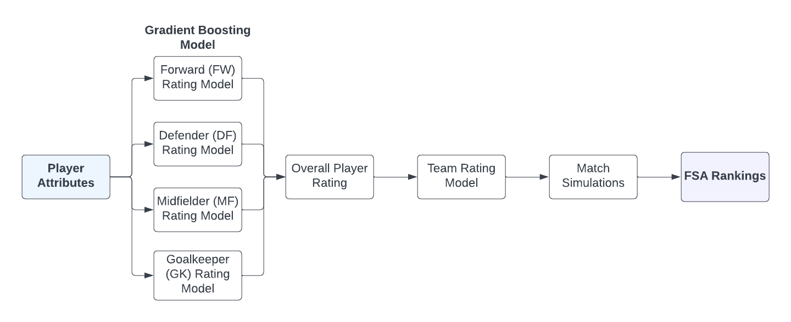
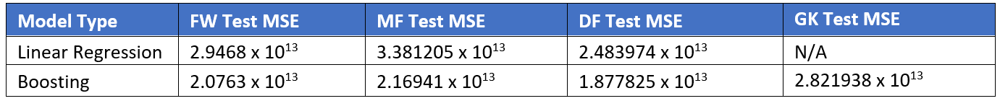
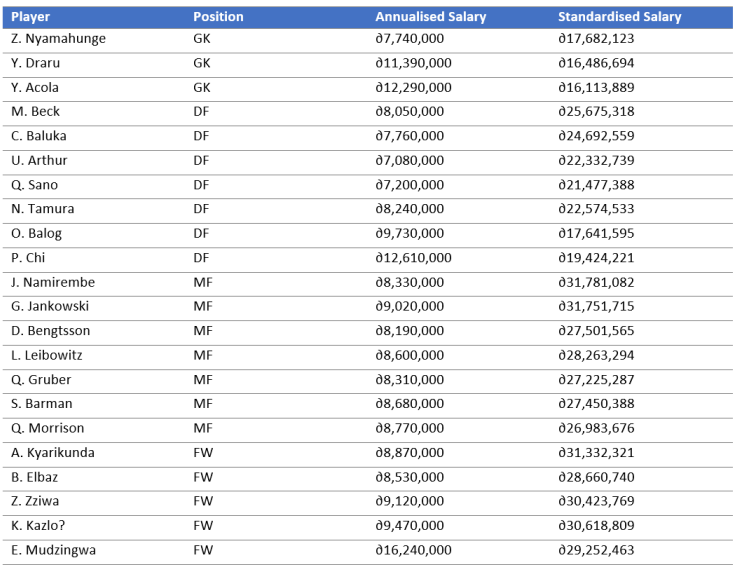

Actuarial Theory and Practice A Assignment
==========================================

By Aidan Yeoh, Alex Zhu, Annie Zhu, Matthew Winfred, Rosie Tao

1.  Background
2.  Data Cleaning Steps
3.  Modelling Steps
4.  Economic Impact Steps
5.  Conclusion

For Data Collection, we have conducted the following steps: 1. Excel
files are converted to R via `convert_excel_to_r.R`. The file mainly
uses `readxl` package to read excel tables of specified ranges. 2.
Cleaning and preparation pipelines are built in `R_files/merge_data.R`.
This file treats merges data sets from different excel sheets together,
manages data inconsistencies, imputes missing or negative values, and
remove unnecessary columns. 3. Exploratory Data Analysis are conducted
in `R_files/exploratory.R` as well as a preliminary linear regression.
Some plots from exploratory analysis are generated below.

``` r
ggplot(PLAYER_league_non_goal_salary, aes(x = League, 
                                          y = Annualized_Salary))+
    geom_boxplot()+
    theme_bw()+
    labs(x = "League", y = "Annualised Salary (∂)", title = "Box Plot of Annualized Salary per League")+
    theme(axis.text=element_text(size=9.5), axis.title=element_text(size=13, face = "bold"), plot.title = element_text(size=14, face = "bold"))+
    scale_y_continuous(labels = scales::unit_format(unit = "M", scale = 1e-6))
```


``` r
#KPI analysis
fw.kpi <- c('Standard_Sh','Standard_SoT','Standard_G/Sh','Expected_xG')
mf.kpi <- c('CrsPA','KP','Total_Cmp','PPA','1/3')
df.kpi <- c('Int','Clr','Tackles_TklW')
gk.kpi <- c('Performance_GA90')

#Histogram plots

make.histogram <- function(kpis, position, data, path = F) {
    
    for (kpi in kpis) {
        position.df <- PLAYER_league_non_goal_salary %>%
            filter(Pos_new == position)%>%
            filter(!(abs(!!as.name(kpi) - median(!!as.name(kpi))) > 2*sd(!!as.name(kpi))))
        p<- ggplot(position.df, aes(x = !!as.name(kpi))) +
            geom_histogram(stat = "count")+
            labs(title = paste(position, "histogram"))
        print(p)
        
    }
}

# make.histogram(fw.kpi, 'FW',PLAYER_league_non_goal_salary)
# make.histogram(df.kpi, 'DF',PLAYER_league_non_goal_salary)
# make.histogram(mf.kpi, 'MF',PLAYER_league_non_goal_salary)
# make.histogram(gk.kpi, 'GK',PLAYER_league_goal_salary)
```

Modelling Steps
===============



Player Rating Model
-------------------

Our team is chosen from a pool of RFL players exclusively to prevent
language, cultural and political barriers from impeding overall team
cohesion (Malesky, Saiegh 2014). This selection consists of 5 forwards,
7 midfielders, 7 defenders, and 3 goalkeepers. The modelling of
individual player ratings assumes the following:

-   Salaries of league players are reflective of their skill level.
-   The attributes relevant in determining skill level are
    position-specific. Thus, player ratings for each position should be
    modelled individually.
-   Player performance in leagues translates to tournaments.
-   The level of play is consistent across leagues.

Although player salary is the assumed player rating metric, exploratory
analysis shows that salaries in RFL deviate noticeably compared to other
leagues despite RFL players delivering similar performances. Thus, the
use of a model linking player attributes to a standardised salary figure
is necessary.

To develop a predictive model linking player attributes to salaries, the
evaluation criteria of validation-set error is used. The non-RFL league
player data is split into a 90% training set and 10% test set. Several
candidate models are then fitted, and their corresponding validation-set
error computed. Note that:

-   Model fitting occurred independently for each position (FW, DF, MF,
    GK).
-   Goalkeepers are modelled only using goalkeeping data. Here, it is
    assumed that goalkeepers do not require the same level of attacking,
    passing etc. as other positions, and that goalkeeping specific
    skills are their most important attributes.



The selected player-rating model is a gradient boosting model (GBM)
trained on the non-RFL player league due to its higher predictive
performance (at the cost of less interpretability). The four boosting
models utilise the following parameters:

-   An interaction depth of 1 resulting in each tree becoming a stump.
    This leads to a more interpretable additive model.
-   A shrinkage parameter of 0.01 which is sufficiently low for
    predictive needs.
-   The number of trees is calculated using 10-fold cross-validation
    error. As a large number of trees will lead to overfitting and a
    small number of trees will be inflexible, the number of trees that
    corresponds to the lowest cross-validation error is selected.

``` r
#FW Player Rating Model
gbmFit.param_FW <- gbm(Annualized_Salary ~., data = cor_df_merge[(cor_df_merge['League'] != "RFL") & (cor_df_merge['Pos_new'] == "FW"),-c(19,20,21,22,23)], distribution = "gaussian", cv.fold = 10, n.trees = 3000, interaction.depth = 1, shrinkage = 0.01)
#MF Player Rating Model
gbmFit.param_MF <- gbm(Annualized_Salary ~., data = cor_df_merge[(cor_df_merge['League'] != "RFL") & (cor_df_merge['Pos_new'] == "MF"),-c(19,20,21,22,23)], distribution = "gaussian", cv.fold = 10, n.trees = 3000, interaction.depth = 1, shrinkage = 0.01)
#DF Player Rating Model
gbmFit.param_DF <- gbm(Annualized_Salary ~., data = cor_df_merge[(cor_df_merge['League'] != "RFL") & (cor_df_merge['Pos_new'] == "DF"),-c(19,20,21,22,23)], distribution = "gaussian", cv.fold = 10, n.trees = 3000, interaction.depth = 1, shrinkage = 0.01)
#GK Player Rating Model
gbmFit.param_GK <- gbm(Annualized_Salary ~., data = gk_df[(gk_df['League'] != "RFL"),-c(16,17,18,19,20)], distribution = "gaussian", cv.fold = 10, n.trees = 3000, interaction.depth = 1, shrinkage = 0.01)
```

To optimise the number of trees in the GBMs, CV error as a function of
number of trees is plotted below. Note that the green and black lines
represent test error and training error respectively.

**TODO: Add title to graphs**

``` r
par(mfrow = c(2,2))
FW_cv <- gbm.perf(gbmFit.param_FW, method = "cv")
MF_cv <- gbm.perf(gbmFit.param_MF, method = "cv")
DF_cv <- gbm.perf(gbmFit.param_DF, method = "cv")
GK_cv <- gbm.perf(gbmFit.param_GK, method = "cv")
```


Player Selection
----------------

Our goal is to enlist the most cost-efficient RFL players for player
selection that maximise economic impact. These players exhibit the
highest standardised-to-annualised salary ratios, delivering high
performance at low cost. However, player selection is restricted to the
top 25% highest-paid players to meet our FSA performance objectives.
Without this additional restriction, sufficient competitiveness is not
achieved.

``` r
#FW
FW_plot_data <- data.frame(cbind(Standardised_Salary = gbm.predict_FW[(df['League'] == "RFL") & (cor_df_merge['Pos_new'] == "FW")], Annualised_Salary = df$Annualized_Salary[(df['League'] == "RFL") & (cor_df_merge['Pos_new'] == "FW")]))
FW_select <- FW_plot_data[(gbm.predict_FW[(df['League'] == "RFL") & (cor_df_merge['Pos_new'] == "FW")]/df$Annualized_Salary[(df['League'] == "RFL") & (cor_df_merge['Pos_new'] == "FW")] > 4.41),]

ggplot(FW_plot_data, aes(x = Annualised_Salary, y = Standardised_Salary)) +
    geom_point()+
    theme_bw()+
    geom_smooth(method=lm, se = FALSE, formula=y~x-1)+
    geom_encircle(data = FW_select, color = "red", size = 2, expand = 0.03)+
    labs(x = paste0("Annualised Salary (",expression(partialdiff)), y = "Standardised Salary (∂)", title = "Relationship between Standardised and Annualised Salary", subtitle = "RFL FW Players")+
    theme(axis.text=element_text(size=9.5), axis.title=element_text(size=13, face = "bold"), plot.title = element_text(size=14, face = "bold"))+
    scale_y_continuous(labels = scales::unit_format(unit = "M", scale = 1e-6))+
    scale_x_continuous(labels = scales::unit_format(unit = "M", scale = 1e-6))
```


``` r
#MF
MF_plot_data <- data.frame(cbind(Standardised_Salary = gbm.predict_MF[(df['League'] == "RFL") & (cor_df_merge['Pos_new'] == "MF")], Annualised_Salary = df$Annualized_Salary[(df['League'] == "RFL") & (cor_df_merge['Pos_new'] == "MF")]))
MF_select <- MF_plot_data[
    (gbm.predict_MF[(df['League'] == "RFL") & (cor_df_merge['Pos_new'] == "MF")]/df$Annualized_Salary[(df['League'] == "RFL") & (cor_df_merge['Pos_new'] == "MF")]>4.4),]

ggplot(MF_plot_data, aes(x = Annualised_Salary, y = Standardised_Salary)) +
    geom_point()+
    theme_bw()+
    geom_smooth(method=lm, se = FALSE, formula=y~x-1)+
    geom_encircle(data = MF_select, color = "red", size = 2, expand = 0.03)+
    labs(x = "Annualised Salary (∂)", y = "Standardised Salary (∂)", title = "Relationship between Standardised and Annualised Salary", subtitle = "RFL MF Players")+
    theme(axis.text=element_text(size=9.5), axis.title=element_text(size=13, face = "bold"), plot.title = element_text(size=14, face = "bold"))+
    scale_y_continuous(labels = scales::unit_format(unit = "M", scale = 1e-6))+
    scale_x_continuous(labels = scales::unit_format(unit = "M", scale = 1e-6))
```


``` r
#DF
DF_plot_data <- data.frame(cbind(Standardised_Salary = gbm.predict_DF[(df['League'] == "RFL") & (cor_df_merge['Pos_new'] == "DF")], Annualised_Salary = df$Annualized_Salary[(df['League'] == "RFL") & (cor_df_merge['Pos_new'] == "DF")]))
DF_select <- DF_plot_data[(gbm.predict_DF[(df['League'] == "RFL") & (cor_df_merge['Pos_new'] == "DF")]/df$Annualized_Salary[(df['League'] == "RFL") & (cor_df_merge['Pos_new'] == "DF")] > 4.35),]

ggplot(DF_plot_data, aes(x = Annualised_Salary, y = Standardised_Salary)) +
    geom_point()+
    theme_bw()+
    geom_smooth(method=lm, se = FALSE, formula=y~x-1)+
    geom_encircle(data = DF_select, color = "red", size = 2, expand = 0.03)+
    labs(x = "Annualised Salary (∂)", y = "Standardised Salary (∂)", title = "Relationship between Standardised and Annualised Salary", subtitle = "RFL DF Players")+
    theme(axis.text=element_text(size=9.5), axis.title=element_text(size=13, face = "bold"), plot.title = element_text(size=14, face = "bold"))+
    scale_y_continuous(labels = scales::unit_format(unit = "M", scale = 1e-6))+
    scale_x_continuous(labels = scales::unit_format(unit = "M", scale = 1e-6))
```


``` r
#GK
GK_plot_data <- data.frame(cbind(Standardised_Salary = gbm.predict_GK[(df['League'] == "RFL")], Annualised_Salary = gk_df$Annualized_Salary[(df['League'] == "RFL")]))
GK_select <- GK_plot_data[(gbm.predict_GK[(df['League'] == "RFL")]/gk_df$Annualized_Salary[(df['League'] == "RFL")] > 1),]

ggplot(GK_plot_data, aes(x = Annualised_Salary, y = Standardised_Salary)) +
    geom_point()+
    theme_bw()+
    geom_smooth(method=lm, se = FALSE, formula=y~x-1)+
    geom_encircle(data = GK_select, color = "red", size = 2, expand = 0.03)+
    labs(x = "Annualised Salary (∂)", y = "Standardised Salary (∂)", title = "Relationship between Standardised and Annualised Salary", subtitle = "RFL GK Players")+
    theme(axis.text=element_text(size=9.5), axis.title=element_text(size=13, face = "bold"), plot.title = element_text(size=14, face = "bold"))+
    scale_y_continuous(labels = scales::unit_format(unit = "M", scale = 1e-6))+
    scale_x_continuous(labels = scales::unit_format(unit = "M", scale = 1e-6))
```

    ## Warning: Removed 395 rows containing non-finite values (stat_smooth).

    ## Warning: Removed 395 rows containing missing values (geom_point).

    ## Warning: Removed 395 rows containing missing values (geom_encircle).


Following this criteria led to picking a player selection for the
national team as illustrated below:



Team Rating Model
-----------------

A team rating model is created to rate team performance and calculate
the probability that a team wins a matchup. This model:

1.  Determines a team’s position score by averaging standardised
    salaries over each player position.
2.  Calculates the difference between two competing team’s position
    scores.
3.  Inputs the differences in position scores (**TODO: Insert excel
    hyperlink to match\_model\_data.xlsx**) into a GBM that outputs the
    probability of winning the matchup

This model suggests that the differential in FW team scores is the most
significant predictor in this GBM, highlighting the necessity of strong
FW players

**TODO: Insert table that shows the team data and probability of
winning**

``` r
gbm_match <- gbm(Outcome ~., data = model_data[,-c(2,3,4,5)], distribution = "bernoulli", n.trees = min_match_param, interaction.depth = 1, shrinkage = 0.01)
summary(gbm_match)
```

    ##                             var   rel.inf
    ## FW_Score_Dif       FW_Score_Dif 71.426665
    ## MF_Score_Dif       MF_Score_Dif  9.791857
    ## DF_Score_Dif       DF_Score_Dif  9.511791
    ## GK_Score_Dif       GK_Score_Dif  5.306472
    ## Total_Score_Dif Total_Score_Dif  3.963215

FSA Match Simulation
--------------------

To calculate probabilties of fulfilling the objectives of Top 10 in 5
years and winning the FSA Championships in 10 years, we ran 1000
simulations of tournament bracket outcomes to obtain a single
probability using the code block below. We then repeated this process
1000 times to generate a distribution of probabilities.

``` r
#Our team vs [18,23],[12,17],[6,11],[1,5]

set.seed(1)
#Probability that our team is in the top 10 at least once within 5 years
prob_top10_5yrs <- c()
for (i in 1:1000) {
    #successful outcome
    sim_counter <- 0
    #Calculate a single probability
    for (j in 1:1000) {
        win_two_match_prob <- national.team.matchups[floor(runif(5, min = 18, max = 24)),"Probs"]*national.team.matchups[floor(runif(5, min = 12, max = 17)),"Probs"]
        #How many times I become top 10 in 5 yrs
        count <- 0
        
        for (k in 1:5) {
            count <- count + rbinom(1, 1, win_two_match_prob[k])
        }
        
        if (count >= 1) {
            sim_counter <- sim_counter + 1
        }
    }
    
    prob_top10_5yrs[i] <- sim_counter/1000
}
```

Competitiveness of team
-----------------------

Based on our selected national team, we can see that the national team
comfortably exceeds the performance constraints. Here, the 95%
confidence interval for the probabilities of attaining an FSA
championship top-10 in 5 years and winning the FSA championship in 10
years is (91.540%, 91.647%) and (76.332%, 76.500%) respectively. These
are well above the corresponding 85% and 70% thresholds established
earlier.

``` r
par(mfrow = c(1,2))
ggplot(prob_top10_5yrs.df)+
    geom_histogram(aes(x = probs, y = ..density..), color = "black", fill="#5662d1", bins = 30)+
    labs(x = "Probability of attaining FSA Top 10 in 5 years", y = "Density", title = "Distribution of Simulated Probability", subtitle = "FSA Top 10 in 5 years")+
    theme_bw() +
    theme(axis.text=element_text(size=9.5), axis.title=element_text(size=13, face = "bold"), plot.title = element_text(size=16, face = "bold"), plot.subtitle=element_text(size=13))
```


``` r
ggplot(prob_win_10yrs.df)+
    geom_histogram(aes(x = probs, y = ..density..), color = "black", fill="#5662d1", bins = 30)+
    labs(x = "Probability of winning FSA Championship in 10 years", y = "Density", title = "Distribution of Simulated Probability", subtitle = "FSA Championship in 10 years")+
    theme_bw() +
    theme(axis.text=element_text(size=9.5), axis.title=element_text(size=13, face = "bold"), plot.title = element_text(size=16, face = "bold"), plot.subtitle=element_text(size=13))
```


Limitations of Team Selection
-----------------------------

Several limitations were inherent to the modelling process: \* It is
assumed that all teams in FSA maintain the same team composition over
ten years and that players remain at their skill level (ignoring
skill-growth and aging). This is unlikely to be valid in practice. \*
Alternative models such as neural networks and AdaBoost were not
considered and may have exhibited higher predictive power. \* Models are
fitted using a validation-set approach, removing the incorporation of
potentially valuable information. The resulting model is dependent on
which observations are included in the training and validation sets.

Economic Impact
===============

Implementation Plan
===================

Ethics
======

Risk and Risk Mitigation Considerations
=======================================

Conclusion
==========
